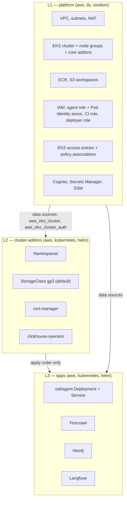
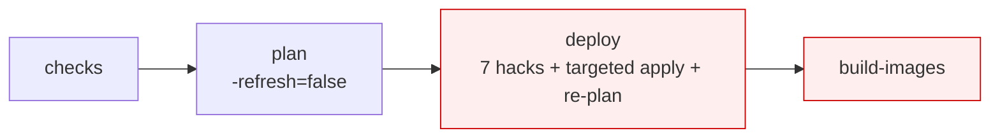
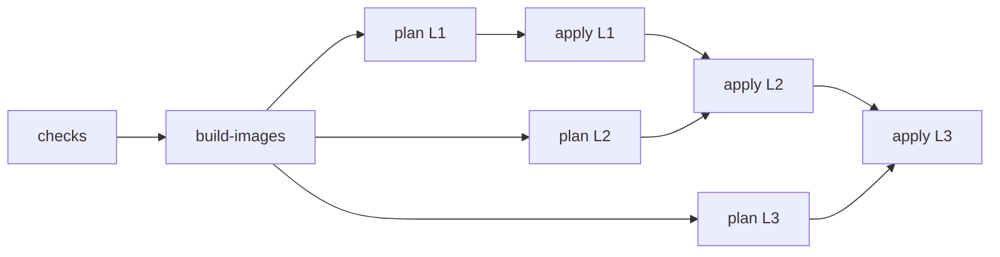

# Design Document: EKS Platform Restructure

## Overview

`workloads/eaf/dev` has never successfully applied. Not once. The ECR repositories
are empty, which means the agent — the product — has never run. Sixty-odd `fix/*`
branches over 74 PRs have been spent on this, each one a single line, each one
validated only by a twenty-minute CI round trip.

That pattern is not a discipline problem. It is what happens when structural
faults interact, and none of them is visible from inside a single error message.
This document names six structural faults, plus a seventh that is quieter and more
expensive: the written record of *why* the system is shaped this way has drifted
far enough from reality that it can no longer be used to reason.

They are numbered RC1–RC7 in the order they were found, not the order they appear.
RC5 is the documentation fault and reads as the closer; RC6 and RC7 were found
later, while preparing the teardown, and both concern **ownership** — a layer
depending on something it is itself responsible for creating. That is RC2's shape
recurring in IAM and in cross-account authentication rather than in providers,
which is the strongest evidence that the layer boundary was the root problem.

The restructure has one goal, stated plainly: **replace `workloads/eaf/dev` with
reusable modules applied through three layered root modules, and bring the
platform up on an empty cluster.** The existing configuration is not repaired. It
is deleted and rebuilt, because it carries drift and patches that cost more to
reconcile than to discard.

---

## Revision — decisions taken

This document was first written on the assumption that the existing workloads
would be migrated. That assumption is withdrawn. The following decisions are
settled and the rest of the document is written to them.

| Decision | Consequence |
|---|---|
| **Delete `workloads/eaf/dev` and rebuild.** Bootstrap and `accounts/*` are preserved | The State Reconciliation Migration section is removed. It existed to preserve resources that are now being discarded |
| **Reusable modules, not root-module resources.** `modules/` holds the reusable units; the three root modules compose them | `workloads/eaf/dev`'s flat resource layout is not carried forward. No file is copied without being rewritten |
| **Four namespaces:** `eaf`, `monitoring`, `memory`, `tools` | Langfuse, Firecrawl, Neo4j and later Graphiti are all in scope. The earlier Scope Reduction argument for removing them is withdrawn |
| **Cluster version 1.36** | 1.31 left standard support on 26 Nov 2025 and leaves extended support on 26 Nov 2026. Rebuilding on 1.31 would mean upgrading within weeks |
| **State keys under `workloads/dev/<layer>/`** | `bootstrap/seed/iam.tf` grants dev state access to `workloads/dev/*` only. Any other prefix is denied. Zero bootstrap change required |
| **The infra repo owns every Kubernetes object and all state.** The agent repo builds and pushes images only | The agent repo's `kubectl apply` path is deleted. See RC6 and Delivery Ownership |
| **Agent runnability is out of scope.** The application cannot currently start | L3 ships the `eaf` namespace and ServiceAccount only. The tool stack is the acceptance test, not the agent |
| **`bedrock_primary_model` is correct as written.** `bedrock_fast_model` is not | Verified against the live API. Security finding 5 is rewritten |
| **Memory lands in two steps:** Neo4j first, Graphiti second | Neo4j is the stateful part and is useful regardless. Graphiti needs an LLM and embedder decision that has no consumer yet |
| **The local development loop is built first, not last** | It needs no credentials, and it is what makes every later step cheap. Moved from Step 6 to Step 1 |
| **Firecrawl is the web tool. No Brave API.** Agentic browsing is deferred | Self-hosted Firecrawl is five services, not the four currently declared |

---

## Problem Statement

*Grounded in what was measured, not in what the Terraform says.*

Everything in this section was read live from the cluster and the AWS APIs, not
inferred from the Terraform.

### The cluster as it actually is

| | `ip-10-0-11-46` | `ip-10-0-11-109` |
|---|---|---|
| Instance type | `t3.medium` | `t3.large` |
| Node group | `default` | `langfuse` |
| Allocatable CPU | 1930m | 1930m |
| Allocatable memory | 3376684Ki (~3.22 GiB) | 7253552Ki (~6.92 GiB) |
| `maxPods` | 17 | 35 |
| Taint | none | `dedicated=langfuse:NoSchedule` |
| Pods running | **16 — at the ceiling** | 4 |

Cluster `eaf-dev` is ACTIVE on Kubernetes 1.31. Pod state across it: **12 Pending,
6 ImagePullBackOff, 1 CrashLoopBackOff.** The scheduler's own words, from the
events: `Too many pods`, `Insufficient cpu`, `Insufficient memory`,
`node(s) had untolerated taint {dedicated: langfuse}`.

Nine of ten PVCs are Pending on the `gp2-csi` StorageClass. That class uses
`WaitForFirstConsumer`, so those PVCs are Pending *because* their pods cannot
schedule. Symptom, not cause — worth stating so it does not get fixed twice.

### The registries

| Repository | Images |
|---|---|
| `tools/firecrawl` | 0 |
| `tools/firecrawl-playwright` | 0 |
| `eaf/agent` | 0 |

### The pipeline

Every `deploy` job on `main` has failed. The most recent (run `33320638814`):

```
Error: waiting for EKS Add-On (eaf-dev:aws-ebs-csi-driver) create:
       timeout while waiting for state to become 'ACTIVE'
       (last state: 'CREATING', timeout: 20m0s)
Error: context deadline exceeded
Warning: Helm release "" was created but has a failed status.
```

Twenty minutes to reach that. No local reproduction path. That is the feedback
loop that produced `fix/ebs-csi-driver`, `fix/ebs-csi-import`,
`fix/ebs-csi-activate`, `fix/langfuse-postgres`, `fix/langfuse-redis-auth`,
`fix/langfuse-clickhouse-auth`, `fix/langfuse-neo4j`, `fix/two-phase-apply`,
`fix/stale-plan`, `fix/plan-lock-clear`, `fix/remove-assume-role-provider`.

Read that branch list as a diagnostic. It is a random walk. Each name is a
symptom, and the symptoms are downstream of the same six causes.

---

## Root Causes

### Reading this without Kubernetes background

Four terms carry most of the weight below. Worth ten lines, because the first two
root causes are only obvious once these are in place.

**Container image.** A packaged, immutable copy of an application and everything it
needs to run. Built once, then stored in a registry.

**ECR.** AWS's container registry. Kubernetes pulls images from it. If an image is
not there, nothing can start.

**Pod.** One running instance of one or more containers — the smallest thing
Kubernetes schedules. A **Deployment** is a declaration like "keep one pod of this
image running"; Kubernetes then does the work.

**Scheduling.** Kubernetes decides which machine (**node**) each pod runs on. A pod
that has nowhere to go sits in `Pending` forever. The status names in this document
say what went wrong: `ImagePullBackOff` means the image could not be fetched,
`Pending` means no node would take the pod, `CrashLoopBackOff` means the container
started and died repeatedly.

**Terraform provider.** A plugin Terraform uses to talk to one system. `aws` is one
provider. `kubernetes` is another. `helm` is another. Terraform itself knows nothing
about any of them — the plugin does the talking.

**Provider configuration.** The `provider` block *we* write, telling that plugin how
to connect. Two separate things worth keeping apart:

| | |
|---|---|
| The **provider** | code AWS or HashiCorp ships. We download it, we do not write it |
| The **provider configuration** | the `provider "aws" { ... }` block in our `.tf` files. Ours. This is the part that is wrong in `workloads/eaf/dev` |

`TERRAFORM-NOTES.md` §2 and §5 already cover the block types; the point that matters
for RC2 is *when* Terraform reads the configuration. It reads it **first**, as setup,
before it works out what to create. So every value in a `provider` block has to be
knowable before any work starts.

For AWS that is easy — a region, and credentials the runner already holds:

```hcl
provider "aws" {
  region = var.region        # a plain string. Known before anything runs
}
```

For Kubernetes it is not, because a cluster has its own address and its own
credential, and neither exists until the cluster does:

```hcl
provider "kubernetes" {
  host = aws_eks_cluster.this.endpoint   # ← this run creates that cluster
}
```

That single difference is the whole of RC2.

### RC1 — The pipeline builds images after the deploy that needs them

`pipeline.yml` declares:

```
checks → plan → deploy → build-images
```

`build-images` has `needs: deploy`. But `deploy` creates Kubernetes Deployments
whose containers reference `718438899462.dkr.ecr.eu-west-2.amazonaws.com/tools/firecrawl:latest`
and `.../tools/firecrawl-playwright:latest`. ECR is empty.

So: `deploy` cannot converge, because the images do not exist. The images are
never built, because `build-images` needs `deploy` to succeed first. Every single
`ImagePullBackOff` in the cluster traces to this one line of job ordering.

**In plain terms.** The pipeline is told to install the application before it is
told to build it. Kubernetes is asked to run an image that has never been created,
so it tries to download it, fails, and reports `ImagePullBackOff`. Because the
install step fails, the pipeline stops, and the build step — which is queued behind
it — never runs. So the image never gets created, which is the reason the install
failed. Nothing about this improves with retries; the order is simply wrong.

A second fault rides along with it. `build-images` tags each image with both the
commit SHA and `latest`, and the Kubernetes manifests reference `:latest`. A tag is
just a label pointing at some bytes, and `latest` gets moved to point at new bytes
on every build. So the manifests say "run whatever `latest` currently means",
which is not something Git records. There is no rollback — `:latest` yesterday and
`:latest` today are different bytes with the same name. A commit SHA never moves,
which is why it is the right tag to deploy.

**Correction: this does not explain the empty `eaf/agent` repository.** The job
ordering above accounts for `tools/firecrawl` and `tools/firecrawl-playwright`,
which this pipeline builds. It does not account for `eaf/agent`, because the
`build-images` matrix in `pipeline.yml` contains only the two tool images. The
agent image is built by a workflow in the *application* repository —
`build-and-deploy.yml` — which this document had not read.

That repository has its own, unrelated defect. `ecr.tf` sets
`image_tag_mutability = "IMMUTABLE"` on `eaf/agent`, and the agent workflow pushes
both `:${sha}` and `:latest` on every build. An immutable repository rejects any
attempt to move an existing tag, so the second and every subsequent push of
`:latest` fails. The `tools/*` repositories are `MUTABLE` with the comment "tool
images use `:latest` tag", so they need the opposite change once nothing
references `:latest` any more.

Both faults point the same way — the deployed reference must be an immutable
commit SHA — but they are two faults in two repositories, and fixing the job
ordering here does not fix the other one.

### RC2 — One root module owns AWS, Kubernetes and Helm

`provider.tf` configures both the `helm` and `kubernetes` providers from
attributes of a resource created in the same apply:

```hcl
provider "kubernetes" {
  host                   = aws_eks_cluster.this.endpoint
  cluster_ca_certificate = base64decode(aws_eks_cluster.this.certificate_authority[0].data)
  ...
}
```

**In plain terms.** Terraform has to know how to connect to Kubernetes *before* it
starts doing work — that connection detail is part of its setup, not part of the
work. But here the connection address is taken from the cluster, and the cluster is
one of the things this same run is supposed to create. So Terraform is being asked
for the address of something that does not exist yet.

The nearest everyday version: you are handed one list of instructions that says
"phone the office and ask them what to do", and also says "build the office". On the
first run there is no phone number. On later runs there is, so it sometimes works —
and *sometimes works* is worse than never working, because it hides the fault and
turns every failure into a guess.

This is the load-bearing fault. Terraform evaluates provider configuration
before it knows the values, so at plan time the cluster attributes may be
unknown; at apply time they exist but the provider was already configured.
HashiCorp's own guidance is direct about it: [a single apply is not a dependable
way to stand up Kubernetes infrastructure with Terraform, and the cluster
configuration should be separated from the Kubernetes resources into distinct
configurations, each with its own run and its own state file](https://support.hashicorp.com/hc/en-us/articles/4408936406803-Kubernetes-Provider-block-fails-with-connect-connection-refused).
The `terraform-provider-kubernetes` maintainers reached the same conclusion:
[the dependable arrangement is for the cluster and the provider's resources to be
managed by separate applies, with data sources supplying the provider's values](https://github.com/hashicorp/terraform-provider-kubernetes/commit/ac549769e85df47c5744c0dac26d9b53ef0d87e1).
The HashiCorp community discussion on the same point notes that
[interpolating provider credentials from resources declared in the same module as
that provider's resources produces intermittent errors that are hard to
diagnose](https://discuss.hashicorp.com/t/provider-configuration-through-interpolation/22538).
*Content was rephrased for compliance with licensing restrictions.*

"Intermittent and hard to diagnose" is exactly the shape of the last sixty
commits.

Every downstream compromise in this repository is a consequence of that one
block, and each is visible in the code:

| Compromise | Where | What it costs |
|---|---|---|
| Targeted phase-1 apply on `aws_eks_access_policy_association.*` | `pipeline.yml` deploy job | The apply is now two applies |
| Phase 2 must re-plan | `pipeline.yml`: *"phase 1 changes state so saved plans go stale"* | **The reviewer-approved-plan guarantee is gone** |
| `plan -refresh=false` | `pipeline.yml` plan job | Plan no longer compares against reality — and, as RC7 shows, it also concealed that the plan job was authenticated to the wrong account entirely |
| `wait = false`, `wait_for_rollout = false` | `langfuse.tf` | Apply reports success before the release is healthy |
| One Helm failure aborts unrelated AWS resources | observed | The `ebs-csi` timeout took the whole apply down |
| Hardcoded `import` block with a literal account id | `eks.tf` | Not portable to prod; runs on every plan |

Note the third row especially. `-refresh=false` exists because the read-only plan
role has no Kubernetes API access, so a refresh of the `kubernetes_*` resources
fails. The comment in the workflow says to remove it "after first successful
deploy" — a deploy that has never happened.

### RC3 — The cluster is materially too small for what is installed on it

This is arithmetic, and no further `fix/*` commit changes it. Right-Sizing Analysis
does the sums. The short version: the untainted capacity is one `t3.medium` — 17 pod
slots, 1930m CPU, 3.22 GiB — and the untainted demand is roughly 18 pods, 2045m
and 4.9 GiB. Over budget on all three dimensions at once.

Meanwhile the `t3.large` sits at 4 of 35 pods, and nothing untainted can reach
it. That is a taint/toleration asymmetry, not a capacity shortage:

- `langfuse.tf` sets the `dedicated=langfuse` toleration on the `langfuse`,
  `postgresql`, `clickhouse.cluster`, `clickhouse.keeper` and `s3` sub-charts.
- It does **not** set one on the `redis` (Valkey) sub-chart.
- `memory.tf` gives Neo4j no toleration at all, and Neo4j requests
  `500m` / `2Gi` — so it can only target the node that is already full.

Capacity exists. The pods that need it are forbidden from using it.

### RC4 — Live state has diverged, and the pipeline now conceals it

The `deploy` job carries a block titled *"one-time state fix"* containing seven
out-of-band mutations, each commented *"Remove this block after first successful
apply"*:

1. `terraform state rm kubernetes_deployment.searxng`
2. `terraform state rm` + `terraform import kubernetes_storage_class.gp2_default` (`gp2-csi`, created out-of-band with `kubectl`)
3. `terraform state rm` + `import` for four Firecrawl Deployments, to repair a null identity
4. `aws secretsmanager delete-secret --force-delete-without-recovery` on `eaf-dev/gateway/agent-client-creds`
5. `aws s3 rm` of the `.tflock` object to clear a stuck lock
6. `|| true` on the phase-1 apply
7. `2>/dev/null || true` on every `state rm` and `import` above

Two problems, and the second is worse than the first.

The first: this is the pipeline making AWS and state changes outside a plan.
`CLAUDE.md` is unambiguous — *"No resource is created, modified, or destroyed
through … scripts written to apply a one-off fix"*, and *"a change that cannot go
through the pipeline is a signal that the pipeline needs to be extended — not
bypassed."* Putting the bypass *inside* the pipeline file does not satisfy the
rule; there is still no plan and no approval for those seven mutations.

The second: `|| true` and `2>/dev/null` mean these steps cannot fail. A run where
all seven silently did nothing is indistinguishable from a run where all seven
worked. The pipeline has lost the ability to report its own state.

Actual drift measured in the cluster:

| Declared | Live | Why |
|---|---|---|
| `langfuse` chart 2.0.2, non-Bitnami `postgres:18` | `docker.io/bitnami/postgresql:17.3.0-debian-12-r1`, ImagePullBackOff | The 1.x→2.x upgrade never converged. Bitnami [moved its existing images to a `bitnamilegacy` repository and stopped publishing versioned free tags to Docker Hub from 28 August 2025](https://github.com/bitnami/charts/issues/35164), so the pinned tag no longer resolves. *Content was rephrased for compliance with licensing restrictions.* |
| `clickhouse.cluster.replicas = 1`, `keeper.replicas = 1` | 3 ClickHouse shards + 3 ZooKeeper replicas | Left over from an earlier chart generation |
| `searxng` removed from config and `state rm`'d | **still running** in namespace `tools` | Orphan. Consumes one of the 17 pod slots |

### RC6 — Ownership is undefined: the layer creates its own deployer, and two systems deploy the agent

*Numbered after RC5 because it was found later. It belongs with RC2 — both are a
layer depending on something it is itself responsible for creating.*

**Part one: the workloads layer creates the role that applies the workloads layer.**

`iam.tf` declares `aws_iam_role.workload_deployer`, named
`eaf-workload-dev-deployer-role`. That is the role `pipeline.yml`'s deploy job
assumes in order to apply this layer. Verified live: it carries
`AdministratorAccess` plus an inline `cross-account-state-access` policy, and its
trust policy accepts the infra repository's OIDC token on `ref:refs/heads/*`.

So the layer that the role exists to apply is also the layer that defines the role.
On a first apply there is no role to assume. On a destroy, the role deletes itself
partway through and the remainder of the destroy fails with expired authority. The
same is true of `eaf-agent-ci-role`, which the *application* repository assumes to
push images — a workloads destroy removes the application pipeline's credentials
as a side effect.

This is RC2's shape in IAM rather than in providers: a prerequisite created by the
thing that requires it. It is why `bootstrap/seed` was built the way it was, and
the reasoning was not carried down to the workload layer.

What already survives, verified live in `EAF-DEV`:

| Resource | Owning layer | Status |
|---|---|---|
| `eaf-workload-boundary` (policy) | `accounts/dev` via `modules/account-baseline` | Survives. `iam.tf` references it by literal ARN, so it must |
| `eaf-workload-ci-role` | `accounts/dev` via `modules/account-baseline` | Survives. Carries the boundary — but has **no policies attached at all**. An empty shell today |

**The fix.** The role that applies a layer belongs to an *earlier* layer. The
deployer role and its permissions move into `modules/account-baseline`, so they
live in `accounts/dev` state alongside the boundary and the CI role. The workloads
layers then consume a role they did not create, exactly as they consume a cluster
they did not create. This also makes the teardown in Step 2 possible at all.

**Part two: two systems deploy the agent.**

`build-and-deploy.yml` in the application repository runs, after pushing the
image:

```
kubectl apply -f k8s/namespace.yaml
kubectl apply -f k8s/service-account.yaml
kubectl apply -f k8s/deployment.yaml
kubectl apply -f k8s/service.yaml
kubectl set image deployment/agent agent=...:${sha} --namespace eaf
kubectl rollout status deployment/agent --namespace eaf --timeout=300s
```

No state file, no plan, no approval. This is why the agent's namespace,
ServiceAccount, Deployment and Service are invisible to Terraform: nothing
declares them. It is also the same violation RC4 describes — a change reaching the
cluster outside a plan — living in a different repository.

If L3 also declared those objects, the two would fight: Terraform would revert
`kubectl set image` as drift, and the next `kubectl apply` would drift Terraform.
The Deployment's true definition would depend on which pipeline ran last.

A further mismatch, visible only when both repositories are read together:
`k8s/deployment.yaml` points the agent at `SEARXNG_URL`, `CRAWL4AI_URL` and
`QDRANT_URL`. `searxng` is the orphan RC4 wants deleted; `crawl4ai` and `qdrant`
appear nowhere in this repository at all. Meanwhile the Terraform deploys
Firecrawl, which the application configuration never mentions. The application and
the platform disagree about the entire tool layer.

**The fix.** See Delivery Ownership. The infra repository owns every Kubernetes
object and all state; the application repository builds and pushes an
immutable-tagged image and stops there.

### RC7 — The cross-account hop was removed, and three things broke quietly

*Found while preparing the teardown. It is the mechanism behind RC6 part one, and
it explains why `-refresh=false` was load-bearing rather than merely lazy.*

Commit `cff1ec9` (30 August) deleted the `assume_role` block from
`workloads/eaf/dev/provider.tf`, and the matching `--role-arn` argument from the
`helm` and `kubernetes` `exec` blocks. Its message: *"remove assume_role from
provider.tf — deployer role is already in EAF-DEV"*. Accurate, and it does remove
a hop.

Before that commit the credential chain was:

```
GitHub OIDC
  -> eaf-baseline-dev-role          (management 193027353132)
  -> OrganizationAccountAccessRole  (EAF-DEV 718438899462)
```

Neither of those is declared in the workloads layer, so both survive destroying
it. After the commit, the chain was a single hop to
`eaf-workload-dev-deployer-role`, which **is** declared in the layer.

**Consequence 1: the teardown stopped working.** `destroy-workloads.yml`
succeeded on 29 August — run `33244371784`, *"Destroy complete! Resources: 71
destroyed."* — authenticating as `eaf-baseline-dev-role` with the hop in place.
It cannot authenticate today. The job declares `environment: dev`, so its OIDC
subject is `...:environment:dev`, while the deployer role's trust accepts only
`...:ref:refs/heads/*`. IAM Reference §3, live.

**Consequence 2: a repository variable silently changed behaviour.** The workflow
selects its role with
`${{ vars.AWS_WORKLOAD_DEV_DEPLOYER_ROLE_ARN || vars.AWS_BASELINE_DEV_ROLE_ARN }}`.
On 29 August the first variable did not exist, so the expression fell through to
the baseline role and worked. The variable was created eight hours later, at
which point the expression began selecting a role that cannot be assumed from
this workflow. **Adding a variable broke a workflow that does not mention it.** A
`||` between two roles with different trust conditions is not a fallback, it is a
hidden switch.

**Consequence 3: the `plan` job has been passing without checking anything.**
This is the quietest and the most misleading:

| | |
|---|---|
| Authenticates as | `eaf-bootstrap-plan-role` — **management account** |
| Plans | `workloads/eaf/dev` — resources all in **EAF-DEV** |
| Provider | no `assume_role`, so Terraform operates in the management account |
| Refresh | `-refresh=false`, so it never reads those resources |

It compares configuration against the state file and never contacts the account
the resources live in. It passes because it is not looking. The workflow comment
attributes `-refresh=false` to the plan role being *"read-only on state"*; the
actual reason a refresh fails is the wrong-account provider.

And it cannot be repaired in place. `eaf-bootstrap-plan-role` carries the
AWS-managed `ReadOnlyAccess`, whose only `sts` actions are
`sts:GetAccessKeyInfo`, `sts:GetCallerIdentity` and `sts:GetSessionToken` —
verified against the live policy document. **No `sts:AssumeRole`**, so it cannot
make the hop. That is precisely why `cff1ec9` removed the block: restoring it
fails the plan job. The constraint was real; the direction taken was wrong.

**The fix.** Restore the hop, because the teardown needs it, and retire the plan
of this layer rather than pretend it verifies something. A plan earns its place
when it can read the resources it describes with refresh enabled, which requires
a per-layer plan role holding in-account read access — L1 work. Per Correctness
Property 3, no layer's plan is considered valid until refresh is on.

### RC5 — The documentation describes a system that does not exist

This matters more than it looks. In this repository the prose *is* the reasoning
record — `TERRAFORM-NOTES.md` and `CLAUDE.md` are how decisions survive. When
they drift, the ability to reason about the system drifts with them.

| Document says | Reality |
|---|---|
| `make plan-org`, `make policy-check`, `make checks` | `Makefile` has `fmt`, `fmt-check`, `lint`, `validate`, `check`, `install-hooks`. None of the three exist |
| Workflows named `checks`, `plan`, `apply` | One `pipeline.yml` with four jobs |
| *"Still to build"* lists the workload layers as unbuilt | `workloads/eaf/dev` is deployed |
| `### 2. Branch protection` | Appears twice, duplicated verbatim |
| `WORKLOG.md`: `bootstrap/org-structure` never applied (newest entry 2026-08-14) | `EAF-DEV` `718438899462` exists, so it was applied |

Doc reconciliation is **in scope** for this effort, as its own step with its own
acceptance criteria. Not a follow-up.

### Lower-severity findings, recorded so they are not rediscovered

- **AgentCore Gateway does not exist.** `agentcore-gateway.tf` has
  `aws_bedrockagentcore_gateway` commented out pending provider support, and
  `aws_ssm_parameter.gateway_endpoint` is hardcoded to the literal string
  `"PENDING"`. Real: Cognito, IAM, Secrets Manager, a security group. Any agent
  code that expects a Gateway endpoint cannot work.
- **`recovery_window_in_days = 0`** on `aws_secretsmanager_secret.gateway_client_creds`
  is why hack 4 exists. See Security Findings, finding 4.
- **No `.terraform.lock.hcl`** in `workloads/eaf/dev`. Provider versions are
  declared but not locked for this layer, so a CI runner may resolve differently
  from a laptop. A reproducibility gap in the layer that most needs
  reproducibility.
- **Diagnostics on `langfuse.tf` and `provider.tf`** (`Blocks of type "set" are
  not expected here`, `Blocks of type "kubernetes" are not expected here`) are
  helm-provider v2-versus-v3 schema differences. `provider.tf` pins `helm 2.17.0`,
  where both forms are valid, so these are editor-side false positives — and they
  would be *real* errors the moment anyone bumps to helm v3. The missing lock file
  is what makes that a live risk rather than a hypothetical one.
- **`variables.tf` hardcodes identity.** `account_id` defaults to a literal
  account number and `ops_role_arn` defaults to an SSO role ARN including a
  permanent-set id (`..._a8fd6486dea1ff46`). Both are per-account facts baked into
  code that is meant to serve dev and prod.
- **`bedrock_fast_model` default is `anthropic.claude-haiku-4-5-20251001-v1:0`** —
  available in `eu-west-2` through an inference profile only, and the SCP denies
  inference profiles. `iam.tf` builds `foundation-model` ARNs from it, so the
  policy names a resource that does not exist on-demand in this region.
  `bedrock_primary_model` is fine. See Security Findings, finding 5.

---

## Architecture

One rule generates the whole layout: **a root module must never configure a
provider from a resource it creates.** Everything else follows.

`workloads/eaf/dev` splits into three root modules, each with its own state key,
applied in sequence.



Dependency direction is strictly downward. L1 knows nothing about L2 or L3.

### State keys

| Layer | Directory | State key |
|---|---|---|
| L1 | `workloads/eaf/dev/platform` | `workloads/dev/platform/terraform.tfstate` |
| L2 | `workloads/eaf/dev/cluster-addons` | `workloads/dev/cluster-addons/terraform.tfstate` |
| L3 | `workloads/eaf/dev/apps` | `workloads/dev/apps/terraform.tfstate` |
| *(current, deleted at Step 2)* | `workloads/eaf/dev` | `workloads/dev/terraform.tfstate` |

**The key prefix is a constraint, not a preference.** `bootstrap/seed/iam.tf`
grants the dev principals state access to `${bucket}/accounts/dev/*` and
`${bucket}/workloads/dev/*`, and the lock policy is scoped to
`${bucket}/workloads/dev/*.tflock`. A key such as
`workloads/eaf/dev/platform/terraform.tfstate` does not match that prefix, so the
layer's first `init` would fail on `AccessDenied` against state. Keeping the
directory path (`workloads/eaf/dev/<layer>`) decoupled from the state key
(`workloads/dev/<layer>/`) satisfies the existing policy with no change to
`bootstrap`, which is the layer this effort is not permitted to touch.

Same bucket (`eaf-bootstrap-tfstate-193027353132`), same `use_lockfile = true`.
Three keys means three independent locks, so a stuck L3 lock cannot block an L1
apply — which removes the need for hack 5. This follows the
[AWS Prescriptive Guidance recommendation to hold Terraform state in S3 with
locking and encryption enabled](https://docs.aws.amazon.com/prescriptive-guidance/latest/terraform-aws-provider-best-practices/backend.html),
and the [guidance on organising a Terraform code base into separate
configurations rather than one large root module](https://docs.aws.amazon.com/prescriptive-guidance/latest/terraform-aws-provider-best-practices/structure.html).
*Content was rephrased for compliance with licensing restrictions.*

### Why the boundaries fall where they do

| Boundary | Reason |
|---|---|
| L1 / L2 | L1 creates the cluster; L2 configures the `kubernetes` and `helm` providers. They cannot share an apply. This is the whole point |
| L2 / L3 | Blast radius. A failed Langfuse release must not prevent cert-manager or a StorageClass from converging. That is precisely what the `ebs-csi` timeout did |
| Access entries in L1, not L2 | The deployer role's EKS access entry must exist *before* L2's provider authenticates. Put it in L1 and it is created by an earlier apply — so the targeted phase-1 apply disappears, and with it the forced re-plan |

Each layer gets its own committed `.terraform.lock.hcl`.

---

## Components and Interfaces

### The provider configuration pattern

**Decision: data sources, not `terraform_remote_state`, for anything that feeds a
provider block.**

```hcl
# L2 and L3
data "aws_eks_cluster" "this" {
  name = var.cluster_name        # a plain string input, not a remote-state lookup
}

data "aws_eks_cluster_auth" "this" {
  name = var.cluster_name
}

provider "kubernetes" {
  host                   = data.aws_eks_cluster.this.endpoint
  cluster_ca_certificate = base64decode(data.aws_eks_cluster.this.certificate_authority[0].data)
  token                  = data.aws_eks_cluster_auth.this.token
}
```

The reasoning, in order:

1. The [`terraform-provider-kubernetes` guidance is to source provider values from
   data sources and keep the cluster in a separate apply](https://github.com/hashicorp/terraform-provider-kubernetes/commit/ac549769e85df47c5744c0dac26d9b53ef0d87e1).
   *Content was rephrased for compliance with licensing restrictions.*
2. `data.aws_eks_cluster` reads the live cluster. If the cluster is absent or not
   yet ACTIVE, the data source errors immediately with a clear message, rather
   than the provider configuring against an unknown value and failing later
   inside a Kubernetes API call.
3. `var.cluster_name` is a string. It does not create a state-file coupling
   between layers, so L2's plan does not break when L1's outputs are refactored.

`terraform_remote_state` is still the right tool for non-provider values that L2
and L3 need from L1 — the ECR registry URL, the agent role ARN, the S3
workspace bucket name. `TERRAFORM-NOTES.md` §6 already makes this argument
(*"Prefer this over hardcoding an ARN"*), and nothing here contradicts it. The
narrower claim is only: **provider configuration is different, and gets data
sources.**

`data.aws_eks_cluster_auth` supplies a token directly instead of the `exec`
block currently in `provider.tf`. One fewer dependency on the `aws` CLI being
present and correctly versioned on the runner.

### L1 — `platform`

**Purpose.** Everything AWS. The only layer that creates the cluster, and the only
layer whose providers are `aws`, `tls` and `random` — no `kubernetes`, no `helm`.

**Owns:** VPC, subnets, NAT, route tables, security groups; the EKS cluster, node
groups and core addons; ECR repositories; S3 workspace buckets; IAM roles
including the agent role, the CI role and the deployer role; EKS access
entries and policy associations; SSM parameters.

**Interface (outputs):**

```hcl
output "cluster_name"          { value = aws_eks_cluster.this.name }
output "cluster_endpoint"      { value = aws_eks_cluster.this.endpoint }
output "oidc_provider_arn"     { value = aws_iam_openid_connect_provider.eks.arn }
output "ecr_registry"          { value = "${var.account_id}.dkr.ecr.${var.region}.amazonaws.com" }
output "agent_role_arn"        { value = aws_iam_role.agent.arn }
output "workspace_bucket"      { value = aws_s3_bucket.workspace.id }
output "node_groups"           { value = { for k, v in local.node_groups : k => v } }
```

**Responsibilities:**
- Create the cluster and make it ACTIVE before any later layer runs.
- Grant the deployer role and the plan role their EKS access entries, so that
  later layers' providers can authenticate without a targeted pre-apply.
- Publish everything a later layer needs. Anything not an output is unreachable —
  which is the point (`TERRAFORM-NOTES.md` §6).

### L2 — `cluster-addons`

**Purpose.** Cluster-level Kubernetes objects that applications assume exist.

**Owns:** the four namespaces (`eaf`, `monitoring`, `memory`, `tools`) with their
baseline NetworkPolicies, the default `gp3` StorageClass, cert-manager, and the
ClickHouse operator.

`gp3` rather than `gp2`: on a from-scratch build there is no reason to provision the
older volume type, which is slower at baseline and costs more. Nothing is bound to
the existing class, so there is no migration to perform.

**Interface (inputs):** `cluster_name`, `region`. Both plain strings. Provider
configuration comes from `data.aws_eks_cluster` / `data.aws_eks_cluster_auth`, not
from L1's state.

**Responsibilities:**
- Fail fast and clearly if the cluster is absent or not ACTIVE.
- Own nothing application-specific, so an application failure cannot take a
  StorageClass with it.

### L3 — `apps`

**Purpose.** The product, and the tool backends it depends on.

**Owns:** the `eaf/agent` Deployment and Service. Later: Firecrawl, Neo4j,
Langfuse.

**Interface (inputs):** `cluster_name`, `region`, `image_tag` (the commit SHA), and
non-provider values read from L1 via `terraform_remote_state` — `ecr_registry`,
`agent_role_arn`, `workspace_bucket`.

**Responsibilities:**
- Reference images only by immutable tag.
- Carry the tolerations and node selectors that match whatever L1 actually
  created. The RC3 asymmetry was a broken contract between these two layers, and
  it existed because they were the same layer and nobody had to write the contract
  down.

---

## Module Structure — the reusable unit

`workloads/eaf/dev` declares 2,091 lines of resources directly in a root module.
Nothing in it is reusable, so `workloads/eaf/prod` would begin as a copy — and a
copy is where the two environments start diverging silently. The rebuild is the
opportunity to fix that, and it costs almost nothing to do at the same time.

### The distinction

A **root module** is a directory you run `terraform` in. It has a `backend`, it
configures providers, and it has exactly one state file. There are three:
`platform`, `cluster-addons`, `apps`.

A **module** is a directory a root module calls. It has no backend, no state of its
own, and — this is the rule that matters — **no `provider` blocks**. It inherits
providers from its caller. A module that configures its own provider cannot be
composed, and it reintroduces RC2 one level down.

### Inventory

| Module | Consumed by | Responsibility |
|---|---|---|
| `modules/network` | L1 | VPC, public and private subnets, IGW, NAT, route tables. Subnet count driven by an AZ-count input, not hardcoded |
| `modules/eks-cluster` | L1 | Cluster, OIDC provider, security groups, access entries, addons with correct ordering |
| `modules/eks-node-group` | L1 | One managed node group. Called once per pool; taints and labels are inputs, and it **outputs them** so L3 can derive tolerations rather than restating them |
| `modules/iam-role` | L1, `accounts/*` | **The only** way any role is created. Generated name, mandatory tags, required boundary, typed trust (`github_oidc` / `eks_pod_identity` / `eks_irsa` / `aws_service` / `account_principal`), scoped `PassRole`. See IAM Role Design |
| `modules/ecr-repository` | L1 | One repository with lifecycle policy, scan-on-push, KMS, immutable tags |
| `modules/k8s-namespace` | L2 | A namespace plus its baseline: default-deny NetworkPolicy, resource quota if given, labels |
| `modules/helm-release` | L2, L3 | A thin, opinionated wrapper: `wait` on by default, bounded timeout, `atomic` on, values passed as a typed object |
| `modules/neo4j` | L3 | Neo4j with authentication, a generated credential in a Secret, PVC sizing, NetworkPolicy |
| `modules/firecrawl` | L3 | The five-service Firecrawl stack as one unit |
| `modules/langfuse` | L3 | Langfuse chart plus its credential Secret |
| `modules/account-baseline` | `accounts/*` | **Exists already.** Gains the workload deployer role in Teardown Phase 0 |

`modules/account-baseline` is the proof the pattern works here — it is already
consumed by both `accounts/dev` and `accounts/prod` from a single source.

### Conventions

These are the rules that make a module reusable rather than merely extracted.

1. **No `provider` blocks, no `backend`, no `terraform` block other than
   `required_version` and `required_providers` constraints.**
2. **No hardcoded account identifiers, ARNs, or region strings.** `variables.tf`
   currently defaults `account_id` to `718438899462` and `ops_role_arn` to an SSO
   ARN containing a permanent-set id. Per-account facts are inputs without
   defaults, so a missing one is an error at plan time rather than a wrong value at
   apply time.
3. **Every input gets a `type` and a `description`; constrained inputs get a
   `validation` block.** The Bedrock model id in finding 5 is the case in point —
   a validation block turns a class of error into a plan-time failure.
4. **Every value another layer needs is an `output`.** Anything not an output is
   unreachable, which is the point.
5. **`for_each` over a map, never `count` over a list.** A list index shifts when
   an element is removed, which destroys and recreates unrelated resources.
6. **Environment differences are inputs, not branches.** No `count = var.environment
   == "prod" ? 1 : 0` inside a module. If dev and prod need different shapes, the
   root modules compose different modules.
7. **A module owns one concept.** `modules/eks-node-group` manages one pool, called
   once per pool, rather than one module managing all pools from a nested map.

### What this buys, concretely

`workloads/eaf/prod` becomes three root modules that call the same modules with
different inputs — different CIDRs, instance types, replica counts, and a private
endpoint from the start. The modules are shared, so a fix reaches both environments,
and a divergence has to be written down as an input rather than appearing as a
silent drift between two copied directories.

It also makes the local loop meaningful. Modules are testable with
`terraform validate`, `tflint` and `terraform test` against no cloud account at all,
which is what allows Step 1 to precede Step 2.

---

## Data Models

The inter-layer contract, stated once. Three of the five faults in this document
are contract violations that were invisible because there was no contract.

### Layer contract

| Value | Produced by | Consumed by | Mechanism | Why that mechanism |
|---|---|---|---|---|
| `cluster_name` | operator input (`var`) | L1, L2, L3 | plain string variable | A provider must not depend on another layer's state file |
| `cluster_endpoint`, `certificate_authority` | AWS | L2, L3 | `data.aws_eks_cluster` | Reads reality; errors immediately if the cluster is missing |
| cluster auth token | AWS STS | L2, L3 | `data.aws_eks_cluster_auth` | Removes the `exec` dependency on the `aws` CLI |
| `ecr_registry` | L1 output | L3 | `terraform_remote_state` | Not provider config, so state coupling is fine and better than a hardcoded ARN |
| `agent_role_arn` | L1 output | L3 | `terraform_remote_state` | Same |
| `workspace_bucket` | L1 output | L3 | `terraform_remote_state` | Same |
| `image_tag` | `github.sha` | L3 | pipeline variable | Immutable. This is what makes rollback possible |
| node group taints/labels | L1 output | L3 | `terraform_remote_state` | So a workload's tolerations are derived from what exists, not from a comment |

That last row is the fix for the taint/toleration asymmetry. When L3 reads the
taints L1 actually created, "which pods need a toleration" stops being something a
human has to remember per sub-chart.

### State layout

| Key | Owns | Provider set |
|---|---|---|
| `workloads/eaf/dev/platform/terraform.tfstate` | AWS resources | `aws`, `tls`, `random` |
| `workloads/eaf/dev/cluster-addons/terraform.tfstate` | cluster-level Kubernetes objects | `aws`, `kubernetes`, `helm` |
| `workloads/eaf/dev/apps/terraform.tfstate` | application workloads | `aws`, `kubernetes`, `helm` |

Backend settings are identical in all three: bucket
`eaf-bootstrap-tfstate-193027353132`, `region = eu-west-2`,
`use_lockfile = true`, `encrypt = true`. Only `key` differs.

### Variables to stop hardcoding

| Variable | Today | Change |
|---|---|---|
| `account_id` | defaults to `718438899462` | no default; supplied per layer. A per-account fact does not belong in code meant to serve dev and prod |
| `ops_role_arn` | defaults to an SSO ARN including a permanent-set id | no default; read from SSM, or supplied by the pipeline |
| `bedrock_primary_model` | `anthropic.claude-sonnet-4-6` | **keep** — verified `ON_DEMAND` in `eu-west-2`. Add a `validation` block rejecting geographic prefixes |
| `bedrock_fast_model` | `anthropic.claude-haiku-4-5-20251001-v1:0` — `INFERENCE_PROFILE` only, denied by the SCP | an on-demand id, e.g. `anthropic.claude-3-haiku-20240307-v1:0`. Same `validation` block |
| `cluster_version` | `1.31` — extended support, ends 26 Nov 2026 | `1.36` |
| `image_tag` | does not exist; manifests use `:latest` | required input, set to the commit SHA |

---

## Pipeline Job Graph

### Current



### Target



`build-images` moves to second, before any plan. Images exist before anything
references them. That single edge reversal is the fix for RC1.

### Job / role matrix

| Job | Runs on | Role assumed | Permissions | Why |
|---|---|---|---|---|
| `checks` | every push | none | — | `fmt-check`, `validate`, `tflint`, YAML, register. No credentials needed, so none granted |
| `build-images` | every push; pushes to ECR on `main` only | `eaf-agent-ci-role` | ECR push to the three named repositories | Narrowest role in the pipeline. Cannot touch EKS or state |
| `plan L1` | every push | `eaf-bootstrap-plan-role` pattern, dev equivalent | `ReadOnlyAccess` + `*.tflock` write | AWS-only layer. Full refresh works today |
| `plan L2`, `plan L3` | every push | same plan role, **plus an EKS access entry with `AmazonEKSViewPolicy`** | read-only in-cluster | This is what removes `-refresh=false`. See below |
| `apply L1` | `main` | `eaf-workload-dev-deployer-role` | see Security Findings, finding 3 | Applies the saved L1 plan |
| `apply L2` | `main`, `needs: apply L1` | same | | Applies the saved L2 plan |
| `apply L3` | `main`, `needs: apply L2` | same | | Applies the saved L3 plan |

### Removing `-refresh=false` — two-question test

`-refresh=false` is a relaxed constraint, so it gets the test from `CLAUDE.md`.

**Why does the constraint exist?** The plan role is read-only *by design*, so
that a plan on any branch cannot change anything. It has no EKS access entry, so
refreshing `kubernetes_*` and `helm_*` resources fails, and `-refresh=false` was
added to get past that.

**What does granting the plan role in-cluster read access leave open?** The role
could read Kubernetes objects in `eaf-dev` on any branch. `AmazonEKSViewPolicy`
maps to the upstream `view` ClusterRole, which does not include Secrets — so
Langfuse credentials and the Kubernetes secret in `langfuse.tf` stay unreadable.
*This mapping must be verified against the live policy before implementation, not
assumed.* If verification shows Secrets are readable, the alternative is a
purpose-built ClusterRole bound through an access entry with
`access_scope = namespace`, which is strictly narrower.

What is gained is not small: with refresh on, `plan` compares code, state and
reality — the three-way agreement `TERRAFORM-NOTES.md` §8 calls the only
trustworthy verification. Without it, a plan is code-versus-state only, and drift
like the three-shard ClickHouse is invisible.

### Preserving the reviewer-approved plan

`CLAUDE.md` principle 4: *"The plan the human reads must be the plan that executes
— not a re-generated plan made afterwards."*

Today that property is broken, and the workflow says so in a comment:
*"Fresh plan after phase 1 — phase 1 changes state so saved plans go stale."*

It is restored structurally, not by adding a check:

1. Access entries and policy associations move to **L1**. Nothing in L2 or L3
   needs a targeted pre-apply, because the thing it was targeting was applied by
   an earlier, separate run.
2. Every layer runs `terraform plan -out=tfplan-<layer>` and uploads it as an
   artefact.
3. Every apply runs `terraform apply tfplan-<layer>` against that artefact.
   No `-target`. No re-plan. No `-auto-approve` on a bare `apply`.
4. Nothing mutates state between plan and apply, so the serial cannot move and
   the plan cannot go stale for the reason described in `TERRAFORM-NOTES.md` §10.

If a saved plan *does* go stale, the correct response is to fail the job and
re-run the plan under review — never to re-plan inside the apply job.

### Image tags

`build-images` stops tagging `:latest` as the deployed reference. Manifests in L3
read the image tag from a variable set to the commit SHA, so the running artefact
is identified by a Git commit and rollback is `apply` of an earlier plan. A
`:latest` tag may still be pushed for human convenience, but nothing in Terraform
or Kubernetes may reference it.

---

## Right-Sizing Analysis

### The arithmetic

Total cluster allocatable, measured: **3860m CPU, ~10.14 GiB, 52 pod slots.**
That looks adequate. It is not, because the taint splits it in two and almost
everything lands on the smaller half.

Untainted capacity — the single `t3.medium`:

| | Available |
|---|---|
| CPU | 1930m |
| Memory | 3.22 GiB |
| Pod slots | 17 |

Untainted demand. Requests are as declared in the Terraform where declared; chart
defaults and DaemonSet requests are approximate and marked so.

| Workload | Source | Pods | CPU requests | Memory requests |
|---|---|---|---|---|
| Neo4j | `memory.tf` — **no toleration** | 1 | 500m | 2.00 GiB |
| Firecrawl redis | `search-tools.tf` | 1 | 50m | 0.06 GiB |
| Firecrawl api | `search-tools.tf` | 1 | 250m | 0.50 GiB |
| Firecrawl playwright | `search-tools.tf` | 1 | 250m | 0.50 GiB |
| Firecrawl worker | `search-tools.tf` | 1 | 250m | 0.50 GiB |
| Langfuse valkey | `langfuse.tf` — toleration **missing** | 1 | ~100m* | ~0.25 GiB* |
| cert-manager | chart | 3 | ~30m* | ~0.10 GiB* |
| clickhouse-operator | chart | 1 | ~50m* | ~0.05 GiB* |
| coredns | addon | 2 | 200m | 0.14 GiB |
| DaemonSets (`aws-node`, `kube-proxy`, `ebs-csi-node`) | addons | 3 | ~155m* | ~0.20 GiB* |
| `ebs-csi-controller` | addon | 2 | ~60m* | ~0.10 GiB* |
| `searxng` orphan | none — not in code or state | 1 | ~50m* | ~0.10 GiB* |
| **agent (not yet deployed)** | `eaf/agent` | 1 | ~250m* | ~0.50 GiB* |
| **Total** | | **19** | **~2145m** | **~5.00 GiB** |

\* approximate — chart or addon default, not declared in this repository.

| Dimension | Available | Required | Verdict |
|---|---|---|---|
| Pod slots | 17 | ~19 | **over** |
| CPU | 1930m | ~2145m | **over** |
| Memory | 3.22 GiB | ~5.00 GiB | **over by ~55%** |

Over budget on all three at once, before the agent is even deployed. The
scheduler's three distinct complaints — `Too many pods`, `Insufficient cpu`,
`Insufficient memory` — are one per dimension. It is telling us exactly this.

And on the other side of the taint, the `t3.large` holds 4 pods of 35, with
~1.4 GiB of ClickHouse and Postgres actually requested against 6.92 GiB
allocatable. **Roughly two thirds of the cluster's memory is unreachable by the
pods that need it.**

### Recommendation

Three changes, in this order.

**1. Enable prefix delegation on the VPC CNI.** Set
`ENABLE_PREFIX_DELEGATION=true` in the `vpc-cni` addon configuration. Instead of
handing a node individual secondary IP addresses, the CNI assigns IP prefixes,
which is what lifts the pod ceiling on small instance types
([EKS best practices: prefix mode for Linux](https://docs.aws.amazon.com/eks/latest/best-practices/prefix-mode-linux.html),
[assigning more IP addresses to nodes with prefixes](https://docs.aws.amazon.com/eks/latest/userguide/cni-increase-ip-addresses.html)).
A `t3.medium` goes from 17 pod slots to the Kubernetes-recommended 110, subject to
CPU and memory. *Content was rephrased for compliance with licensing
restrictions.* Cheapest of the three changes and it eliminates one of the
scheduler's three complaints outright.

**2. Remove the `langfuse` node group and its taint in dev.** It was introduced
so ClickHouse would not evict agent pods. In a cluster with two nodes it achieved
the opposite: it fenced off the larger node, and the tolerations were then
incomplete (`redis`/Valkey has none, Neo4j has none), so it produced the very
starvation it was meant to prevent. Dedicated node groups earn their complexity
when there are enough nodes for isolation to mean something. Here, one homogeneous
untainted node group of adequately sized instances is both simpler and strictly
more capable. Prod may reintroduce isolation later, on evidence.

**3. Size against measured requests, not guesses.** Two figures matter now that the
full tool stack is in scope (Scope and Namespace Layout).

At Step 3, when L1 first applies, only `kube-system` exists: CoreDNS, the
DaemonSets, the EBS CSI controller — roughly 8 pods, ~600m, ~1.5 GiB. One node
covers it, and the node group should not be sized for the end state before the
workloads that justify it exist.

By Step 8, with `eaf`, `monitoring`, `memory` and `tools` all populated, the
estimate is roughly **27 pods, ~4 vCPU and ~11 GiB** of requests. That wants three
nodes at 2 vCPU / 8 GiB, or two at 4 vCPU / 16 GiB.

`desired_size` is therefore raised as each of Steps 5 to 8 lands, from the values
`make render-charts` reports for that step's charts — not set once now from an
estimate. This is the one number in the design that should never be guessed, because
guessing it is what produced RC3.

**Addon ordering must be fixed at the same time.** `eks.tf` gives `coredns` a
`depends_on` the node group, but `kube_proxy` and `vpc_cni` have no ordering at
all. Networking addons must be in place before nodes become Ready, or nodes fail
health checks with `NetworkPluginNotReady`. Correct order: `vpc-cni` and
`kube-proxy` on the cluster → node group → `coredns` and `aws-ebs-csi-driver`.
This is very likely a contributing cause of the recurring `ebs-csi` addon
`CREATING` timeout.

### EKS Auto Mode — considered, deferred, with reasons

**What this is about, in plain terms.** Right now this repository declares the
worker machines by hand: how many, what size, what disk driver, when to add more.
That is the "node group" code in `eks.tf`, and it is where several of the failures
happened. EKS Auto Mode is AWS taking that over — you say what you want to run, AWS
decides and manages the machines.

**And what "migrating IRSA to Pod Identity" means.** An application running in the
cluster still needs AWS permissions — the agent has to call Bedrock. It must prove
who it is without holding a password. There are two mechanisms for that:

| | How it works | Where it is configured |
|---|---|---|
| **IRSA** — what the destroyed layer used | The cluster issues the pod a short-lived signed token; an IAM role's trust policy is written to accept tokens from that specific cluster and that specific service account | IAM trust policies, plus an OIDC provider per cluster |
| **Pod Identity** — AWS's newer mechanism, **and what the rebuild uses** | The association between a service account and an IAM role is recorded in EKS itself; a built-in agent on the node vends credentials | The EKS API |

Both give short-lived credentials, so both satisfy `CLAUDE.md` principle 7. Neither
is a security downgrade. They are just configured in different places.

The catch is that Auto Mode supports **only** Pod Identity. So switching to Auto
Mode is not one change — it also means rewriting how the agent, and the EBS CSI
driver, obtain their AWS permissions. Two mechanisms changing at once, in a system
that currently does not work at all.

[EKS Auto Mode](https://docs.aws.amazon.com/eks/latest/userguide/automode.html)
has AWS manage compute, storage and load balancing for the cluster, and the
[best-practices guidance](https://docs.aws.amazon.com/eks/latest/best-practices/automode.html)
positions it as reducing exactly the operational surface this team has been
losing to. *Content was rephrased for compliance with licensing restrictions.*
On the evidence, it is genuinely attractive: it would remove hand-managed node
groups, the EBS CSI addon and autoscaling — three of the four things that have
failed.

It is still the wrong move **now**, for one reason:

Auto Mode nodes vend IAM credentials through
[EKS Pod Identity, which is built in](https://docs.aws.amazon.com/whitepapers/latest/security-overview-amazon-eks-auto-mode/workloads.html),
and it is the only mechanism available on Auto Mode. The agent's IRSA role in
`iam.tf`, the OIDC provider in `eks.tf` and the `ebs-csi` IRSA role would all have
to migrate to Pod Identity associations. *Content was rephrased for compliance
with licensing restrictions.*

That is a second migration stacked on the rebuild, changing the
identity mechanism at the same time as changing the module boundaries. If
something then breaks, there are two candidate causes and no way to bisect.

Worth being precise about the identity question, since it invites churn:
**IRSA is not deprecated.** Pod Identity is AWS's recommendation for new
workloads; IRSA remains fully supported
([EKS: IAM roles for service accounts](https://docs.aws.amazon.com/eks/latest/userguide/iam-roles-for-service-accounts.html)).
*Content was rephrased for compliance with licensing restrictions.* There is no
deadline forcing this and no reason to churn a working mechanism mid-crisis.

**Decision:** keep managed node groups. Evaluate Auto Mode as its own spec, with its
own decision record, once the agent is running and there is a stable baseline to
compare against. Listed under Non-Goals.

### Revision: the identity half of this decision is reversed — Pod Identity

*Revised 2026-08-31, after the teardown and before `modules/eks-cluster` was written.*

The decision above kept IRSA. **Every premise it rested on has since become false**,
and all three failed for the same reason: the workloads layer no longer exists.

| Premise, as written | Status now |
|---|---|
| "IRSA — what this repo uses today" | Nothing runs today. The layer was destroyed: 82 resources, account verified empty |
| "The agent's IRSA role in `iam.tf`, the OIDC provider in `eks.tf` and the `ebs-csi` IRSA role would all have to migrate" | There is nothing to migrate. Those files were deleted |
| "no reason to churn a working mechanism mid-crisis" | There is no working mechanism to churn |

The original argument was **not** that IRSA is better. It was that changing the identity
mechanism *at the same time as* rebuilding the module boundaries gives two candidate
causes for any failure and no way to bisect. That was correct while a cluster existed.
On an empty account there is no second change — there is only one build, and it can use
either mechanism at identical cost.

So the question reduces to which is right for a greenfield cluster, and AWS answers it
directly. Read from the source of the EKS Best Practices Guide
([`aws/aws-eks-best-practices`](https://github.com/aws/aws-eks-best-practices), branch
`mainline`, 2026-08-31), because the rendered documentation pages returned no
extractable content:

> Unless you have specific usecases for IRSA, we recommend you use EKS Pod Identities
> when using EKS.

— `latest/bpg/security/iam.adoc`

> EKS Pod Identities are the recommended approach for new workloads on supported node
> types, while IRSA remains a fully supported alternative.

— `latest/bpg/security/multiaccount.adoc`

**Every IRSA-only condition AWS lists fails to apply here.** Pod Identity is unavailable
on Fargate, Windows nodes, Outposts, EKS Anywhere and self-managed Kubernetes; this
cluster runs Linux EC2 managed node groups. It caps at 5,000 associations per cluster,
against a workload needing single digits. And its cross-account path is two hops rather
than one — but `CreatePodIdentityAssociation` takes a `targetRoleArn` and **EKS performs
the chaining itself**, exporting a computed `external_id` for the target role's trust
policy. `aws_eks_pod_identity_association` supports both today.

What this buys, concretely:

- **No OIDC provider per cluster**, so no `iam:CreateOpenIDConnectProvider` in the
  deployer's permission set and no per-cluster IAM object to leave behind
- **`RC7`'s VPC-endpoint trap disappears.** Finding 5 below documents that closing the
  public endpoint requires `com.amazonaws.<region>.oidc-eks`, absent which IRSA token
  validation fails from inside the VPC with `NXDOMAIN`. Pod Identity does not validate
  tokens against an OIDC issuer, so Step 10 loses that dependency entirely
- **No STS quota consumption**, and no throttling from SDKs re-assuming roles
- **Session tags** for cluster name, namespace and service account, enabling one role
  shared across service accounts under ABAC rather than a role per workload — which is
  the failure mode this whole effort exists to stop

Two costs, both accepted: the `eks-pod-identity-agent` add-on must be installed **before
the node group**, alongside `vpc-cni` and `kube-proxy`; and associations are eventually
consistent, so they are created in Terraform rather than in any request path.

**`modules/iam-role` keeps its `eks_irsa` trust type.** It is tested and costs nothing to
retain, and it is the correct answer should a Fargate profile or a Windows node group
ever appear. A new `eks_pod_identity` trust type is added alongside it.

*Concepts and the full comparison: `learnings/005-irsa-and-pod-identity.md`.*

---

## Scope and Namespace Layout

**The walking-skeleton reduction is withdrawn.** The earlier draft proposed
deleting Langfuse, Neo4j, Firecrawl, cert-manager and the ClickHouse operator, on
the argument that the fastest route to a running product was to cut everything the
`AGENT-DESIGN.md` skeleton does not need. Two things make that argument no longer
hold.

**The agent cannot start, so it cannot be the acceptance test.** Verified in the
application repository: `Dockerfile` runs `CMD ["python", "-m", "agent"]` and there
is no `agent/__main__.py`; `pyproject.toml` declares the console script
`agent.cli:main` and there is no `agent/cli.py`; `k8s/deployment.yaml` sets
liveness *and* readiness probes on `GET /health:8080` and nothing in the codebase
serves HTTP; and `uv.lock` records the project's dependencies as `pyyaml` alone
while `agent/registry.py` imports `langchain_core`, `numpy` and `httpx` and
`agent/auth/cognito.py` imports `boto3` and `httpx`, so `uv sync --frozen
--no-dev` produces an image whose imports fail. The design cannot order its work
around "the agent runs" when that is blocked on application work this effort does
not own.

**The tool stack is a requirement, not an optional extra.** Langfuse, Firecrawl and
Graphiti-backed memory are wanted in the cluster, each in its own namespace.

So the acceptance test becomes the tool stack itself, which is a better test
anyway: it exercises storage provisioning, scheduling, cluster DNS, secrets and
workload identity, whereas a single stateless Deployment exercises almost none of that.

### Namespaces

| Namespace | Contents | Why separate |
|---|---|---|
| `eaf` | Agent ServiceAccount plus its Pod Identity association now; Deployment and Service when the application can start | Matches what `k8s/deployment.yaml` already declares. The association names `eaf`/`eaf-agent`, so the ServiceAccount must exist in this namespace |
| `monitoring` | Langfuse web and worker, plus its `postgres`, `valkey`, `clickhouse` and `seaweedfs` sub-charts | Observability has a different lifecycle and a different blast radius from the product |
| `memory` | Neo4j now; Graphiti second | Currently Neo4j sits in `tools`, which is why memory and tool workloads compete for one node |
| `tools` | Firecrawl: api, worker, playwright, redis, postgres, rabbitmq | Tool backends are replaceable; the product should not share a failure domain with them |

Cluster-scoped components — cert-manager and the ClickHouse operator — stay where
they are and watch all namespaces. The split does not affect them.

**Renaming has consequences that ship in the same change.**
`k8s/deployment.yaml` hardcodes
`http://langfuse-web.langfuse.svc.cluster.local:3000`; under `monitoring` that
becomes `langfuse-web.monitoring.svc.cluster.local`. `memory.tf`'s documented bolt
address `neo4j.tools.svc.cluster.local:7687` becomes
`neo4j.memory.svc.cluster.local:7687`. A namespace rename that leaves a stale DNS
name behind is a silent failure, so both move with the namespace.

### What is in scope, and in what order

| Component | Step | Notes |
|---|---|---|
| Local development loop | 1 | No credentials. Built first because it makes everything after it cheap |
| Teardown of `workloads/eaf/dev` | 2 | Destroy resources, then delete the emptied state object |
| L1 `platform` | 3 | VPC, EKS 1.36, node group, addons, ECR, S3, roles + Pod Identity associations |
| L2 `cluster-addons` | 4 | The four namespaces, `gp3` StorageClass, cert-manager, ClickHouse operator |
| `memory`: Neo4j | 5 | Auth enabled, credential in a Secret, NetworkPolicy, sized PVC |
| `tools`: Firecrawl | 6 | Five services. API auth and NetworkPolicy, never publicly exposed |
| `monitoring`: Langfuse | 7 | Clean install, chart 2.0.2 / app v4.x, `allowV1Upgrade` removed |
| `memory`: Graphiti | 8 | Bedrock via the OpenAI-compatible proxy. Claude Sonnet 4.6 + Titan embeddings |
| Agent workload | later | Blocked on application runnability, not on this design |

Deliberately still out: Cognito and the AgentCore Gateway (the provider does not
support the resource, and `aws_ssm_parameter.gateway_endpoint` is the literal
string `"PENDING"`), agentic browser automation, and the `searxng` orphan, which
the teardown deletes.

### Capacity, restated for the full stack

The Right-Sizing arithmetic below was computed for the reduced scope and is now a
floor rather than an estimate. With all four namespaces the rough total is on the
order of **27 pods, ~4 vCPU and ~11 GiB of requests** — against the current single
untainted `t3.medium` offering 17 pod slots, 1930m and 3.22 GiB.

That points at roughly three `m6i.large` (2 vCPU / 8 GiB, non-burstable) or two
`m6i.xlarge`, plus prefix delegation so the pod-slot ceiling is not the binding
constraint. Treat the figure as an estimate to be replaced by rendered chart
values in Step 1's `make render-charts`, not as a number to build on. The
recommendation to drop the `langfuse` node group and its taint still holds and
matters more now: with four namespaces and no taint asymmetry, one homogeneous
pool is simpler and strictly more capable.

---

## Delivery Mechanism — should Kubernetes delivery be in Terraform at all?

The module split makes Terraform-managed Kubernetes *work*. It does not make it
the right tool. This deserves an explicit decision, because getting it wrong
means doing the restructure twice.

| | Terraform `kubernetes` + `helm` (split into L2/L3) | GitOps — Flux or Argo CD | Helm invoked directly from CI |
|---|---|---|---|
| Reconciliation model | on apply only; drift invisible between runs | continuous; drift corrected automatically | on run only |
| Long-running stateful releases | poor — `wait = false` exists because apply blocks otherwise | designed for it; health is a first-class concept | poor — same blocking problem |
| Failure isolation | per layer after the split | per `HelmRelease`/`Application` | per release |
| Reviewer-approved plan | yes, `plan -out` | no plan artefact; the Git diff is the review | no plan artefact |
| State to corrupt | yes — the thing that caused RC4 | none for Kubernetes objects | none |
| New components to run | none | a controller in-cluster, plus its bootstrap | none |
| Fit with `CLAUDE.md` pipeline rule | direct: Git → PR → plan → approve → apply | indirect: Git → PR → merge → controller applies. Still Git-gated, no terminal, but the approval gate moves out of Actions | direct |

Two things are true at once. Terraform is a poor fit for reconciling long-running
stateful Helm releases — this repository is the evidence, and `wait = false`,
`wait_for_rollout = false` and the seven hacks are the receipts. And GitOps is a
new component to operate, at a moment when the team's problem is that it operates
too much already.

**Recommendation, in two parts:**

**Now:** keep Terraform for both L2 and L3.

*The earlier draft justified this by saying the walking skeleton has no stateful
Helm releases at all. That justification is gone — Steps 5 to 8 add Neo4j,
Firecrawl's PostgreSQL and RabbitMQ, and Langfuse's four stateful sub-charts. The
conclusion survives, but it now rests on sequencing rather than on the absence of
the problem, and that distinction should be visible to a reader.*

The reasoning that remains: the split is the thing that was missing, and adding it
is a smaller change than replacing the delivery mechanism. Adopting Flux in the
same effort would change the delivery mechanism *and* the module boundaries at
once, which is exactly the mistake Right-Sizing Analysis declines to make for Auto
Mode, for exactly the same reason — two simultaneous migrations leave no way to
bisect a failure.

What makes this tolerable rather than merely deferred is that the specific
mitigations are in scope now, not later. Waits are **enabled** with bounded
timeouts, so an apply no longer reports success over a broken release. Each
stateful component lands in its own step behind its own plan, so a failure is
attributable. And L3 is separate from L1 and L2, so a Langfuse failure cannot take
a StorageClass or a VPC with it — which is precisely what the `ebs-csi` timeout did.

The honest cost: between applies, drift in L3 is invisible. Terraform notices only
when it next runs. That is the property GitOps would fix, and it is the reason the
second half of this recommendation exists rather than being dropped.

**Once Steps 5 to 8 are running:** adopt GitOps for L3 only. The
[AWS Prescriptive Guidance pattern for GitOps with Flux on EKS](https://docs.aws.amazon.com/prescriptive-guidance/latest/patterns/use-gitops-to-self-manage-amazon-eks-clusters.html)
is the reference. Terraform keeps L1 (AWS resources, where its plan/approve model
is a genuine strength) and L2 bootstraps the controller. Application and tool
workloads move to `HelmRelease` manifests in Git.

`wait = false` is the tell. It exists because Terraform's execution model and
Kubernetes' reconciliation model disagree about what "done" means. Turning the
wait off does not resolve the disagreement, it just stops Terraform noticing.

This deferral is recorded under Non-Goals so it does not quietly become part
of this effort.

---

## Delivery Ownership — which repository owns which artefact

RC6 part two established that two systems currently deploy the agent. This section
records the decision, because "both" is not a viable answer and the ambiguity is
what allowed the app/infra tool-layer mismatch to persist unnoticed.

**The rule: whoever declares a Kubernetes object owns it in state.** There is no
arrangement in which the application repository runs `kubectl apply` *and* the
objects are tracked by Terraform. That is why the agent's namespace, ServiceAccount,
Deployment and Service are invisible to state today — nothing declares them.

| Repository | Owns | Does not own |
|---|---|---|
| `Enterprise-Agent-Framework` (application) | Source, tests, `Dockerfile`, build, vulnerability scan, push `eaf/agent:<sha>` to ECR | Any Kubernetes object. Any Terraform state. Any cluster access |
| `Enterprise-Agent-Framework-Infra` (this one) | All three layers, all state, every Kubernetes object including the agent's | The application's source or image contents |

Consequences, all of which are deletions:

- `k8s/namespace.yaml`, `k8s/service-account.yaml`, `k8s/deployment.yaml` and
  `k8s/service.yaml` are removed from the application repository. Their content is
  reproduced as L3 Terraform.
- The `deploy to EKS` step in `build-and-deploy.yml` is removed, along with
  `aws eks update-kubeconfig`, the four `kubectl apply` calls, `kubectl set image`
  and `kubectl rollout status`. The application job ends at `docker push`.
- The application repository no longer needs cluster access at all. Its role
  (`eaf-agent-ci-role`, recreated by L1) needs ECR push and nothing else — which is
  a genuine privilege reduction, not just a reorganisation.

### How the image tag reaches L3

L3 takes `image_tag` as a required input. Three mechanisms were considered:

| Mechanism | Preserves the reviewed plan | Speed | Verdict |
|---|---|---|---|
| Application CI opens a PR against this repository bumping `image_tag` | Yes — the tag is a reviewed commit | Slowest; a deploy is a PR | **Use for prod** |
| Application CI triggers this repository's L3 apply via `workflow_dispatch`, passing the SHA | Yes — plan and apply both run inside the triggered workflow, gated by the `dev` Environment | Fast | **Use for dev** |
| L3 reads the tag from an SSM parameter written by application CI | **No** — the value can change between plan and apply | Fast | **Rejected** |

The third is rejected for the same reason the re-plan inside the apply job is
rejected: it breaks the guarantee that the plan a human read is the plan that
executes. A mechanism that makes the diff non-deterministic is not a convenience,
it is RC2's failure mode arriving by a different route.

The cross-repository trigger must authenticate with a **GitHub App**, not a
personal access token. A PAT is a long-lived credential and is forbidden; this is
the same constraint the VPC runner in Step 9 faces, and it has the same answer.

**While the agent cannot start, none of this is exercised.** L3 declares the `eaf`
namespace and the ServiceAccount only. The tag mechanism is built with the agent
workload, not before it — but the ownership decision is recorded now, because the
`k8s/` deletions in the application repository are a prerequisite for the platform
rebuild not to be immediately drifted by a `kubectl apply`.

---

## Teardown — deleting `workloads/eaf/dev`

*This section replaces the State Reconciliation Migration. That section existed to
preserve resources across a state split. Nothing is being preserved, so the
cross-state `pull`/`mv`/`push` machinery, the dedicated migration workflow, the
Firecrawl null-identity repair and the six migration acceptance criteria are all
withdrawn. This is the single largest simplification in the revision.*

### The ordering is not negotiable

**Deleting a state file does not delete anything in AWS. It orphans it.**

If `workloads/dev/terraform.tfstate` is deleted while the resources exist, the VPC,
the NAT gateway, the EKS control plane, two node groups, four addons, ECR
repositories, S3 buckets, Cognito, a Secrets Manager secret and seven IAM roles all
keep running, keep billing, and are no longer described by anything. Recovering
means importing each one by hand or finding and deleting each one by hand. That is
strictly worse than the drift the teardown is meant to end.

The order is therefore: **destroy the resources, then delete the emptied state
object.** Never the reverse.

### The trap: the deployer role destroys itself

RC6, part one. `eaf-workload-dev-deployer-role` is the role the pipeline assumes to
apply this layer, and it is declared *inside* this layer. A `terraform destroy`
would delete its own authority partway through and then fail with an expired
principal, leaving a half-destroyed layer and no role able to finish the job.
`eaf-agent-ci-role` — which the application repository assumes to push images —
goes the same way.

`eaf-workload-ci-role` looks like the answer, since it lives in `accounts/dev` and
survives. It is not, yet: verified live, it carries the `eaf-workload-boundary`
permissions boundary and **no policies at all**. It cannot destroy anything today.

So the teardown has a prerequisite, and that prerequisite is also the permanent
fix.

### Phases

**Phase 0 — give the teardown a principal that outlives it.**
Move the deployer role and its permissions into `modules/account-baseline`, so they
are created by `accounts/dev` and live in `accounts/dev/terraform.tfstate`. Apply
`accounts/dev` through its existing workflow. The workload layers now consume a
role they did not create, exactly as they consume a cluster they did not create.

This is done first because it is required for Phase 1 to complete, and it is worth
doing regardless — it is the fix for RC6 part one.

**Two traps in Phase 0**, both verified against the live account and both capable of
producing a failure that names something other than its cause.

*Do not attach `eaf-workload-boundary` to this role.* It denies `eks:*`, `ec2:*`,
`kms:*` and `iam:CreateOpenIDConnectProvider` by omission, so the role could neither
destroy the cluster nor create the new one. See Security finding 3, part 2. The
deployer gets its own boundary with a different shape.

*Do not reuse `eaf-workload-ci-role` as-is.* It has the workload boundary and **zero
attached policies**, so its effective permissions are empty. A boundary grants
nothing; it only subtracts.

The trust policy must also match this repository's **immutable** OIDC subject format
— `repo:OWNER@OWNER-ID/REPO@REPO-ID:...` — which is why `modules/account-baseline`
already takes `github_repository_owner_id` and `github_repository_id` as inputs. See
IAM Reference.

**Phase 1 — destroy the resources.**

*Revised: Phase 0 is no longer needed as originally written, because the tool for
this already exists and the principal it needs already exists.*
`destroy-workloads.yml` is a `workflow_dispatch` workflow with a typed `"destroy"`
confirmation and an `environment: dev` gate. It clears a stranded lock, drops
`kubernetes_*` and `helm_release.*` from state — which is the null-identity repair,
already solved — and then destroys. It ran successfully on 29 August, removing 71
resources.

Three changes make it runnable again, all in `fix/restore-cross-account-provider`:

1. **Restore the hop** in `provider.tf` (RC7), so Terraform operates in EAF-DEV
   rather than the management account.
2. **Name `eaf-baseline-dev-role` explicitly**, replacing the `||` expression that
   silently began selecting an unassumable role when a variable was added.
3. **Plan the destroy, then apply the saved plan.** Previously it went straight to
   `terraform destroy -auto-approve`, so a 71-resource teardown ran with no
   preview. Now the step summary records exactly what is removed, and the destroy
   applies the plan that was computed rather than recomputing at apply time — the
   same property Preserving the Reviewer-Approved Plan argues for.

**No new role, no new boundary, no `account-baseline` change** is required to reach
the teardown. `eaf-baseline-dev-role` already has everything needed: it lives in
the management account so it survives, its trust requires `environment:dev` which
the workflow provides, it holds state access to `workloads/dev/*`, and it holds
`sts:AssumeRole` on `OrganizationAccountAccessRole`.

The deployer-role migration into `modules/account-baseline`, and its purpose-built
boundary, move to Step 3 — where they are needed for *applying* L1, not for
destroying the old layer.

The one thing that must not be improvised: **no `|| true`.** Security finding 2
applies to the teardown as much as to the pipeline. If a destroy step fails, it
fails visibly and is diagnosed.

**Phase 2 — confirm the account is empty. The emptied state object stays.**

Assert directly against AWS, not against Terraform's opinion.

*Revised: the original text said to delete `workloads/dev/terraform.tfstate`. It
stays, for two reasons.*

**It cannot be deleted by the principal that runs the teardown, by design.**
`bootstrap/seed` grants `eaf-baseline-dev-role` `s3:GetObject`, `s3:PutObject` and
`s3:ListBucket` on `workloads/dev/*`, and `s3:DeleteObject` **only** on
`workloads/dev/*.tflock`. A role that can empty a state file cannot delete it.
That is a sensible guard, and deleting the object would mean widening a bootstrap
IAM policy — touching the one layer this effort is not permitted to change, to
achieve nothing.

**It is harmless, and it is the record.** After the destroy the object describes
zero resources. The new layers use different keys —
`workloads/dev/platform/`, `workloads/dev/cluster-addons/`,
`workloads/dev/apps/` — so nothing can accidentally consume it, and with the
directory deleted no configuration points at it. An empty state file that nothing
references costs nothing and preserves the history of what was there.

If it is ever worth removing, that is a one-off action by a management-account
principal, not a permission the teardown role should hold.

### Outcome, 2026-08-31

Executed as designed. Dry run first (run `33394116510`): 112 resources tracked,
`Plan: 0 to add, 0 to change, 96 to destroy`, no mutation — the confirmation, lock
clearing, state surgery, plan and apply steps all correctly skipped.

Then the real run (`33394897276`), 11m43s:

```
Apply complete! Resources: 0 added, 0 changed, 82 destroyed.
```

96 minus the 14 `kubernetes_*` and `helm_release.*` entries dropped from state
first, as predicted. Zero errors.

Verified directly against AWS afterwards: no EKS cluster, no non-default VPC, no
NAT gateway, no ECR repositories, no S3 buckets, no secrets, no Cognito pools, no
running instances, no load balancers, no Elastic IPs, no non-default security
groups, no snapshots.

Survivors, exactly as the table above requires: `eaf-workload-ci-role`,
`eaf-workload-boundary`, and the `token.actions.githubusercontent.com` OIDC
provider — which is correct, since `eaf-workload-ci-role` trusts it. The cluster's
own OIDC provider went with the cluster. All seven workloads-owned roles are gone,
including `eaf-workload-dev-deployer-role`, which is not recreated.

### The one thing the teardown missed, and what it teaches

`terraform destroy` reported complete success and left behind an **8 GiB EBS
volume** that Terraform had never heard of:

```
kubernetes.io/created-for/pvc/name       data-langfuse-postgresql-0
kubernetes.io/created-for/pvc/namespace  langfuse
ebs.csi.aws.com/cluster-name             eaf-dev
```

The EBS CSI driver provisioned it in response to a PersistentVolumeClaim, so it
was created through the Kubernetes API rather than by Terraform. The `gp2-csi`
StorageClass carried `reclaim_policy = Delete`, but **a reclaim policy only fires
when the PVC is deleted through the Kubernetes API.** The teardown dropped the
Kubernetes resources from state and destroyed the cluster, so no PVC deletion ever
happened, and the volume outlived everything that knew about it.

This is the storage version of the `searxng` orphan: a resource created by a
controller *inside* the cluster is invisible to the configuration that created the
cluster. It survives a teardown that looks clean, and it goes on billing.

Deleted manually as a recorded step. The durable answer is mechanical:
`make storage-orphans` lists detached volumes carrying the CSI driver's tags and
fails naming them. It runs alongside `make iam-orphans` after each apply.

**Two consequences for later steps.** Step 5 gives Neo4j a PVC, and Step 7 gives
Langfuse four more. Each of those PRs must state that reverting it leaves an
orphaned volume unless the release is uninstalled through Helm first — reverting
Terraform destroys the release from *its* perspective while the PVC deletion may
not propagate. And any future teardown deletes namespaces through the Kubernetes
API *before* destroying the cluster, so reclaim policies get the chance to fire.

### What must survive

| Resource | Owning layer | Note |
|---|---|---|
| Everything under `bootstrap/` | `bootstrap/seed`, `bootstrap/org-structure` | Untouched. Includes the state bucket itself and the OIDC provider in the management account |
| `accounts/dev`, `accounts/prod` state | `accounts/*` | Untouched |
| `eaf-workload-boundary` | `accounts/dev` | Must exist before L1 applies. The literal-ARN reference it used to require is now avoidable: `modules/account-baseline` exposes `workload_boundary_arn` and `workload_boundary_name`, so L1 can read them from `accounts/dev` remote state instead |
| `eaf-workload-ci-role` | `accounts/dev` | Survives; gains policies in Phase 0 |
| The new deployer role | `accounts/dev` after Phase 0 | The principal that runs Phases 1 and 2 |
| `EAF-DEV` account itself, SCPs, OU membership | `bootstrap/org-structure` | Untouched |

Roles that are **expected to disappear** and are recreated by the new L1:
`eaf-dev-cluster-role`, `eaf-dev-node-role`, `eaf-dev-ebs-csi-role`,
`eaf-dev-agent-role`, `eaf-dev-gateway-execution-role`, `eaf-agent-ci-role`, and
the old in-layer `eaf-workload-dev-deployer-role`.

**One consequence to state plainly:** while `eaf-agent-ci-role` is absent, the
application repository's image build cannot push to ECR. That pipeline is already
failing — `eaf/agent` is empty and its `:latest` push cannot succeed against an
`IMMUTABLE` repository — so nothing working is lost. But the new L1 must recreate
that role before the application pipeline can be fixed.

### Acceptance criteria

1. Phase 0 applied: a deployer role exists in `accounts/dev` state with the
   permissions needed to destroy and later to apply the workload layers.
2. No resource formerly declared in `workloads/eaf/dev` remains in `EAF-DEV`,
   asserted by direct AWS queries and recorded in the PR.
3. Every surviving resource in the table above is confirmed present.
4. `workloads/dev/terraform.tfstate` and its lock object are gone; the S3 object
   version history is intact.
5. No command in the teardown used `|| true` or discarded an exit code.
6. The old `workloads/eaf/dev` directory is deleted from the repository in the same
   PR, so there is no configuration describing resources that no longer exist.

---

## IAM Reference — the rules this repository is bound by

*Added because IAM has consumed more debugging time on this project than anything
else, and because most of that time went on four behaviours that are documented and
counter-intuitive. Written from the AWS and GitHub documentation rather than from
recollection, and each claim checked against the live account where checkable.*

### 1. Permissions are an intersection, and a boundary grants nothing

For a request to be allowed, **every** applicable policy type must allow it. AWS
states that when a principal is subject to an SCP, a permissions boundary and an
identity-based policy, [the request is allowed only if all three allow it, and the
effective permissions are the intersection of all
three](https://docs.aws.amazon.com/IAM/latest/UserGuide/access_policies_boundaries.html).
An explicit deny anywhere overrides every allow. Identity policies and *resource*
policies are the exception: those combine as a **union**.
*Content was rephrased for compliance with licensing restrictions.*

The consequence that causes the damage: **a boundary that does not mention a service
denies that service.** A boundary sets a maximum; it never grants. AWS's own worked
example makes the point — a user with a boundary limited to S3, CloudWatch and EC2
cannot create an IAM user even with a policy that explicitly allows
`iam:CreateUser`. *Content was rephrased for compliance with licensing
restrictions.*

Live proof in this account: `eaf-workload-ci-role` carries `eaf-workload-boundary`
and **no attached policies**. Its effective permissions are empty. Attaching
`AdministratorAccess` to it would still not let it create a VPC, because the boundary
never mentions `ec2`.

**Rule for this repository.** Every boundary is paired with the role type it was
written for, and the pairing is stated in the module. A runtime boundary
(`eaf-workload-boundary`: Bedrock, S3, ECR, secrets read, logs) is not a deployer
boundary. Before attaching a boundary, run
`aws iam simulate-custom-policy --policy-input-list <boundary> --action-names <the
actions the role needs>` and confirm none returns `implicitDeny`. That command is
cheap, and it is the difference between a five-second check and a day of reading
`AccessDenied`.

### 2. Do not duplicate a control that the SCP already enforces

The SCP denies non-approved regions, `inference-profile/*` invocation, and long-lived
credentials, for every principal in the account including this one. Since an explicit
deny in an SCP cannot be overridden, a boundary repeating those denials adds nothing
and creates a second place that has to stay in agreement with the first.

**Rule.** Boundaries constrain *reach* — what a role must never touch. The SCP
constrains *environment* — region and residency. Neither restates the other.

### 3. The GitHub OIDC `sub` claim is mutually exclusive by context

This is the single most expensive IAM detail in this repository, and it is the reason
`pipeline.yml` carries the comment *"with `environment: dev` the OIDC sub becomes
`environment:dev` which the deployer role trust policy does not accept"*.

The `sub` claim is not a fixed string with optional parts. Its shape depends on the
job, and GitHub is explicit that the branch form applies **only** when the job does
not reference an environment and was not triggered by a pull request:

| Job context | `sub` |
|---|---|
| references an `environment` | `repo:ORG/REPO:environment:NAME` |
| `pull_request` event, no environment | `repo:ORG/REPO:pull_request` |
| branch push, no environment | `repo:ORG/REPO:ref:refs/heads/BRANCH` |
| tag, no environment | `repo:ORG/REPO:ref:refs/tags/TAG` |

*Content was rephrased for compliance with licensing restrictions. Source:
[OpenID Connect reference](https://docs.github.com/actions/reference/security/oidc).*

So adding `environment: dev` to a job **replaces** the `ref:` segment. It does not
append. A trust policy matching only `ref:refs/heads/*` will reject that job, which
is exactly what happened — and the workaround taken was to remove the environment,
which is the opposite of the intended hardening. The fix is to add the
`environment:dev` subject to the trust policy, not to remove the environment from the
job.

A colon inside a context value is escaped as `%3A`, so an environment named
`prod:eu` appears as `environment:prod%3Aeu`.

### 4. This repository uses immutable subject claims

The live trust policy on `eaf-workload-dev-deployer-role` conditions on:

```
repo:pallasaisrujan28@194785418/Enterprise-Agent-Framework-Infra@1324052608:ref:refs/heads/*
```

That is not a typo. [Repositories created after 15 July 2026 use an immutable default
subject format that embeds the owner ID and repository ID, written
`repo:OWNER@OWNER-ID/REPO@REPO-ID:...`, with `@` as the separator because `@` cannot
appear in a GitHub username or repository
name](https://docs.github.com/actions/reference/security/oidc). The IDs cannot be
removed, even when customising claims. *Content was rephrased for compliance with
licensing restrictions.*

This is why `modules/account-baseline` takes `github_repository_owner_id` and
`github_repository_id` as inputs, and why a trust policy copied from an older tutorial
in the classic `repo:owner/repo:...` form will silently never match.

**Rule.** Trust policies are built from the owner-id and repo-id inputs, never from
hand-written strings, and a role's trust policy is verified with
`aws iam get-role --query Role.AssumeRolePolicyDocument` after the first apply rather
than assumed correct.

### 5. IRSA, and one trap it sets for Step 10

IRSA works by the pod presenting a projected service-account token to
`sts:AssumeRoleWithWebIdentity`. The role's trust policy conditions on two claims
from the cluster's OIDC provider — `<issuer>:sub` equal to
`system:serviceaccount:NAMESPACE:NAME`, and `<issuer>:aud` equal to
`sts.amazonaws.com`. The deleted `iam.tf` did this correctly for
`system:serviceaccount:eaf:eaf-agent` — one of the few things in that layer that was
right, and the reason `modules/iam-role` keeps an `eks_irsa` trust type.

The trap, which would have landed in Step 10: AWS documents that if the cluster
VPC has no outbound internet access and private access to the cluster OIDC endpoint
has not been configured, operations that resolve the OIDC issuer hostname from inside
the VPC fail with `NXDOMAIN`. The remedy is a VPC interface endpoint for
`com.amazonaws.<region>.oidc-eks` with private DNS enabled.
*Content was rephrased for compliance with licensing restrictions. Source:
[IAM roles for service
accounts](https://docs.aws.amazon.com/eks/latest/userguide/iam-roles-for-service-accounts-technical-overview.html).*

> **This trap no longer applies to the rebuild.** The revision under *Right-Sizing
> Analysis* moves workload identity to Pod Identity, which does not resolve or validate
> against an OIDC issuer — the EKS Auth API vends the credentials. Step 10 therefore
> does **not** need `com.amazonaws.<region>.oidc-eks`, and one prerequisite of closing
> the public endpoint disappears.
>
> Kept in full rather than deleted, for two reasons: the `eks_irsa` trust type still
> exists and is the right answer for Fargate or Windows nodes, and this is the sort of
> finding that is expensive to rediscover. If IRSA is ever reintroduced, this endpoint
> is a prerequisite again.

Also worth recording, because it constrains anything external that validates these
tokens: the OIDC signing key pair is rotated by EKS every seven days.

### 6. Roles that create roles

`iam:CreateRole` in the workload boundary is gated on
`iam:PermissionsBoundary` matching the boundary itself — a role can only create roles
that carry the same cap. That is a good pattern and the deployer boundary keeps it:
the deployer may create roles, but only boundaried ones, and may not remove a
boundary from any role including itself.

`iam:PassRole` deserves naming separately. Creating the EKS cluster means passing
`eaf-dev-cluster-role` to EKS; creating a node group means passing
`eaf-dev-node-role`. A deployer without `iam:PassRole` on those specific roles fails
at cluster creation with an error about the role, not about `PassRole`. The generated
policy in Step 11 must scope `iam:PassRole` to the roles L1 actually creates rather
than to `*`.

---

## IAM Role Design — one way in, and no way to lose track

Two requirements drive this section. Roles must be created to a standard rather than
improvised, and **it must be mechanically impossible to lose track of one.** The
second is the harder requirement and the one that has actually bitten: roles were
added to fix failures, each fix was plausible, and the set drifted out of anyone's
head.

Losing track is not a memory problem. It is a missing inventory and a missing
comparison. Both are fixable in code.

### The three failures that let roles drift

**Three different naming schemes.** Verified across the repository:

| Layer | Scheme | Example |
|---|---|---|
| `bootstrap/seed` | `${var.org_prefix}-<purpose>-role` | `eaf-bootstrap-plan-role` |
| `modules/account-baseline` | ~~hardcoded literal~~ → `${var.org_prefix}-workload-<purpose>-role` | `eaf-workload-ci-role` |
| `workloads/eaf/dev` | mixed — `${var.cluster_name}-<purpose>-role` *and* hardcoded | `eaf-dev-agent-role`, `eaf-agent-ci-role` |

Given a role name in the console, there is no rule that tells you which layer owns
it. `eaf-agent-ci-role` and `eaf-dev-agent-role` differ by more than their purpose,
and neither name says "workloads".

**No environment in some names.** `modules/account-baseline` creates
`eaf-workload-ci-role` with no environment segment, so applying it to prod produces a
role of the same name in a different account. Not a collision, but you cannot tell
from a name or an ARN fragment which account you are looking at.

*Still true, and deliberately left alone when `org_prefix` was introduced.* Adding the
segment renames the role, an IAM role name is immutable, so the rename is a
destroy-and-create of a role that survives workload teardown and is referenced by
`AWS_BASELINE_DEV_ROLE_ARN`. The rename is worth doing, and it needs a plan reviewed
against live state plus a `moved` block — not a drive-by inside a portability fix. The
same reasoning kept the `~> 5.0` → `>= 6.0.0` bump out.

**No inventory, so no way to spot an orphan.** There is no artefact listing the roles
the platform is supposed to have. The only way to answer "should this role exist?" is
to grep every layer, which is exactly the work nobody does at 6pm.

### Conventions

Grounded in AWS's [security best practices in
IAM](https://docs.aws.amazon.com/IAM/latest/UserGuide/best-practices.html), which
this design follows on federation for human users, temporary credentials for
workloads, least privilege, Access Analyzer for policy generation and validation, and
last-accessed information for removing what is unused. *Content was rephrased for
compliance with licensing restrictions.*

**1. One module creates every role.** `modules/iam-role`. No `aws_iam_role`
resource is written directly in a root module, ever. A single creation path means a
single place to add a convention and have it apply everywhere retroactively.

**2. Names are generated, never written.** The module composes:

```
${org_prefix}-${environment}-${layer}-${purpose}-role
```

giving `eaf-dev-platform-deployer-role`, `eaf-dev-workload-agent-role`,
`eaf-dev-platform-node-role`. The name states which organisation, which environment,
which layer owns it, and what it is for. Reading a name tells you where its
Terraform lives.

Existing role names change as a result. That is acceptable precisely once — during a
rebuild where every role is being recreated anyway — and it will not be acceptable
again. The one name that must be preserved is `eaf-workload-ci-role`, because it
survives the teardown in `accounts/dev` state; it is renamed in a later, separate
change if at all.

**3. Mandatory tags, enforced by the module's variable contract.** Every role carries
`ManagedBy=terraform`, `ManagedByModule=modules/iam-role`, `OrgPrefix`,
`Environment`, `Layer`, `Purpose`, `Owner`, `TrustType` and `Boundary`. The module
cannot be called without the inputs behind them, because none has a default. They are
merged so that `extra_tags` is applied *first* and the generated set wins on
collision, so a caller cannot relabel a role as unmanaged.

*Corrected during implementation.* An earlier draft of this section specified a
`TerraformAddress` tag as "the load-bearing one". **A module cannot know its own call
address**, so that tag is not producible from inside `modules/iam-role` without the
caller passing its own address as a string — which is exactly the kind of
hand-maintained duplication that goes stale.

The need it was meant to serve is real, and it is met in two better places. The
**name** encodes `org / environment / layer / purpose`, so it already identifies the
owning directory. And `terraform show -json` reports each resource's true `.address`,
which the inventory reads directly. State knows the address; a tag can only ever hold
a copy of it.

**4. A permissions boundary is required, and its type must match the role's type.**
The module takes `boundary_arn` as a **required** input with no default, so omitting
it is an error rather than a silently unboundaried role. Two boundaries exist and
they are not interchangeable — see Security finding 3, part 2:

| Boundary | For | Shape |
|---|---|---|
| `${org_prefix}-${environment}-workload-boundary` | Runtime roles: the agent pod, CI push | Enumerates the services a workload may use |
| `${org_prefix}-${environment}-deployer-boundary` | Infrastructure roles: layer deployers | Denies reach — org and security actions, boundary removal, long-lived credentials, writes to higher layers' state |

**5. Trust policies are built from typed inputs, not strings.** The module takes a
discriminated `trust` object — one of `github_oidc`, `eks_pod_identity`, `eks_irsa`, `aws_service`, or
`account_principal` — and constructs the policy. This is where the two most expensive
IAM bugs in this repository live, so neither is left to a caller:

- For `github_oidc`, the module emits the **immutable** subject form from
  `owner_id` and `repo_id` inputs, and takes a list of *contexts* — for example
  `["environment:dev"]` or `["ref:refs/heads/main"]`. A caller cannot accidentally
  write a `ref:` condition for a job that declares an environment, because the
  context is named explicitly. See IAM Reference §3 and §4.
- For `eks_irsa`, the module takes `namespace` and `service_account` and emits both
  the `:sub` and `:aud` conditions. Omitting `:aud` is a known way to make a trust
  policy far broader than intended, so it is not optional.

**6. `iam:PassRole` is always scoped.** Never `Resource: "*"`. The module takes an
explicit list of role ARNs that may be passed. IAM Reference §6 explains why this
surfaces as a confusing error when missing.

**7. No account identifiers in defaults.** `data.aws_caller_identity` supplies the
account id. A per-account fact with a default is a wrong value waiting to be applied
to the wrong account.

**8. Version constraints follow HashiCorp's split.** Their guidance is that reusable
modules constrain only their **minimum** versions, leaving the caller free to
upgrade, while **root** modules use `~>` to set both bounds. `modules/iam-role`
therefore declares `>= 1.9.0` and `>= 6.0.0`; `modules/account-baseline` currently
declares `~> 5.0`, which is the wrong shape for a module and is corrected in Phase 0.
*Content was rephrased for compliance with licensing restrictions.*

### Two version findings discovered while implementing

**`bootstrap/seed` does not pin what its comment claims.** `provider.tf` sets
`version = "~> 6.57"` with the comment: *"Pinned to the minor. `~> 6.57` accepts
6.57.x patches and refuses 6.58, so a provider release cannot silently change a
plan."*

That is not what the constraint does. HashiCorp documents `~>` as allowing **only the
right-most version component to increment**, and gives `~> 1.1` as permitting 1.2 and
1.10 but not 2.0. So `~> 6.57` permits 6.58 through 6.x — the current release is
6.62.0 — and the stated protection does not exist. Pinning to the minor requires
`~> 6.57.0`. *Content was rephrased for compliance with licensing restrictions.
Source: [Version
Constraints](https://developer.hashicorp.com/terraform/language/expressions/version-constraints).*

This is a small fix with a real consequence: the reason given for the constraint is a
reason to trust plans that the constraint does not actually deliver.

**The repository spans two provider majors.** `bootstrap/*` is on `~> 6.57` while
`accounts/*` and `modules/account-baseline` are on `~> 5.0`, and the retired
`workloads/eaf/dev` pinned `5.100.0` exactly. Three different major/minor positions in
one repository means a module cannot be shared across layers without the caller's
provider version becoming a constraint on the module's contents —
`aws_iam_role_policies_exclusive` is unavailable on 5.x, for instance.

Converging on `~> 6.62.0` for every root module is part of Phase 0, and it is a
provider **major** upgrade for `accounts/*`, so it gets its own plan and its own
review rather than riding along unremarked.

### The inventory, and the check that makes it real

A convention nobody verifies is a comment. Two mechanisms, both cheap:

**A generated inventory.** Each layer outputs the roles it created —
name, ARN, purpose, boundary, trust type. A `make iam-inventory` target collects the
three layers' outputs plus `accounts/*` into a single table. It is generated from
state, never hand-maintained, so it cannot drift from what exists.

**An orphan check in CI, which is the part that actually prevents recurrence.**
`make iam-orphans` lists every role in the account, subtracts those present in
Terraform state, and subtracts the known AWS-managed prefixes
(`AWSServiceRoleFor*`, `AWSReservedSSO_*`, `OrganizationAccountAccessRole`, and
Control Tower's roles). Anything remaining is either an orphan or a role someone
created by hand, and the job fails naming it.

This is the mechanical answer to "we lost track". A role created outside Terraform
survives exactly until the next pipeline run. It generalises the fix that Teardown
acceptance criterion 2 applies once, and it is the same shape as Correctness Property
7 for pods.

**Two periodic reviews**, following AWS's guidance on removing what is unused:

- `aws iam get-service-last-accessed-details` per role, reported in the inventory. A
  role with no activity is a candidate for deletion, with evidence rather than
  opinion.
- Access Analyzer policy validation on every policy document in `checks`, before
  credentials are used. AWS documents over a hundred policy checks; the repository
  already argues for validating policies mechanically rather than by eye, and
  `README.md` describes exactly this capability for SCPs.

### Reusability defects found in `modules/account-baseline`

The module is genuinely parameterised — `account_name`, `environment` with a
`validation` block, `region`, budget inputs — and is already consumed by both
`accounts/dev` and `accounts/prod`. Five things stop it being portable, and all
are fixed as part of Teardown Phase 0 rather than later:

| Defect | Where | Fix | Status |
|---|---|---|---|
| `eaf-workload-boundary` and `eaf-workload-ci-role` are hardcoded literals, and the boundary ARN is rebuilt as a literal string four times | `main.tf:135,146,165,216` | An `org_prefix` input, as `bootstrap/seed` already has. Name declared once in a local; the ARN derived from that same local | **done** |
| `github_repository_owner_id` **defaults** to `194785418` | `variables.tf` | Remove the default. A per-organisation fact must be supplied | **done** |
| Budget name `eaf-${var.account_name}-monthly` hardcodes the prefix | `main.tf:226` | `${var.org_prefix}-${var.account_name}-monthly` | **done** |
| `region` **defaults** to `"eu-west-2"` | `variables.tf:45` | Remove the default. A module that guesses its region is not portable, and the guess is invisible at the call site | **done** |
| Provider constraint is `~> 5.0` | `main.tf:6` | `>= 5.0.0` — see below | **partly** |
| `token.actions.githubusercontent.com` written out three times, including as a condition-key prefix | `main.tf` | Property 19: the issuer host is derived from the provider URL, which becomes an input | **done** |
| `aws_guardduty_detector.datasources` is deprecated in favour of `aws_guardduty_detector_feature` | `main.tf:86` | Deferred — see below | **open** |

### Correction: the stated fix for the boundary ARN was impossible

This table previously said to *"reference the boundary by
`aws_iam_policy.workload_boundary.arn`, not a constructed string."* **That cannot be
done, and attempting it deadlocks the graph.**

The two statements that name the boundary — `AllowIAMWithBoundary`, which conditions
role creation on it, and `DenyBoundaryRemoval`, which forbids its removal — live
*inside* `data.aws_iam_policy_document.workload_boundary`. That document **is** the
`policy` body of `aws_iam_policy.workload_boundary`. Referencing that resource's `.arn`
from within its own body is a self-reference, and Terraform rejects it as a cycle.
There is no attribute to depend on, because the thing being described does not exist
yet. This is the same shape as RC2 — a value needed before the resource that produces
it can exist — arrived at from the opposite direction.

So the ARN stays constructed, and what is removed is the *drift risk* instead: the name
is declared once as `local.boundary_name`, and both `aws_iam_policy.workload_boundary`
and `local.boundary_arn` are built from it. A rename now moves them together. Pinned by
`boundary_arn_cannot_drift_from_the_boundary_name`, which asserts the constructed ARN
and the policy's actual name agree — the guarantee the missing attribute reference
would have given.

*The general rule still holds: prefer an attribute reference, because a string creates
no dependency edge. This is a genuine exception, and it is worth knowing which is
which.*

### Why the provider constraint moved to `>= 5.0.0`, not `>= 6.0.0`

The defect is the **shape**. A pessimistic `~> 5.0` inside a module forbids the caller
from selecting a newer major, which is the root module's decision and its lock file's
job to hold. `>= 5.0.0` fixes that and changes no resolved version.

Raising the floor to 6.x is a different change with a different risk profile:
`accounts/dev` and `accounts/prod` are **live**, neither commits a `.terraform.lock.hcl`,
and a provider major upgrade wants a reviewed plan against real state. Bundling it here
would hide a behavioural change inside a rename. It gets its own PR, as does the
GuardDuty `datasources` deprecation — both are behavioural, both touch live resources,
and neither is a portability defect.

*Confirmed rather than assumed:* a local `terraform init` in `accounts/dev` after the
change resolved `constraints = ">= 5.0.0, ~> 5.0"` to `5.100.0`. The root module's
`~> 5.0` in `provider.tf` still holds the version, which is the point — the module
stopped dictating, and the layer decides.

### A trap when closing the Property 8 gap

`accounts/*` commit no lock file, which Property 8 wants fixed. **Do not fix it by
committing a lock file generated on a workstation.** `terraform init` records hashes only
for the current platform, so a macOS-generated lock file omits `linux_amd64` and CI then
fails with *"provider does not have a package available for your current platform"* —
a failure that looks like a registry problem and is not.

The lock file has to be generated for every platform that runs it:

```
terraform providers lock \
  -platform=darwin_arm64 -platform=darwin_amd64 -platform=linux_amd64
```

### Verification available for this module

Its state lives in the management account's bucket and is not reachable from a
workstation, so *a plan against real state was not available* to confirm that
introducing `org_prefix` renames nothing. An IAM policy or role name is immutable, so a
name change forces replacement — and the boundary is referenced by the workloads layer.

In place of a plan, `modules/account-baseline/tests/` pins the three live names as
literals (`eaf-workload-boundary`, `eaf-workload-ci-role`, `eaf-EAF-DEV-monthly`) and
`accounts/{dev,prod}` pass `org_prefix = "eaf"`, which reproduces them exactly. A future
edit to how a name is built fails offline rather than proposing a replacement against a
real account. **This is weaker than a reviewed plan and should be treated as such: the
first apply of `accounts/dev` after this merges wants a human reading the plan for
`replace`.**

One honest limitation of these tests: `mock_provider` stubs every data source,
including `aws_iam_policy_document`, whose `json` is computed by the provider. They
therefore assert generated names and the constructed ARN — plain locals, read through
the new `inventory` output — and not the rendered policy JSON.

---

## Security Findings

Each finding gets the `CLAUDE.md` two-question test. Where a constraint is
relaxed, both answers are written out. Where it is tightened, the answer to
question 2 is "nothing" and that is the justification.

**All seven findings are fixed within this effort. None is carried as accepted
risk.** Two of them (1 and 3) cannot be fixed in a single step, because closing the
endpoint requires the CI runner to move first, and narrowing the deployer role
requires one successful apply to measure against. Those are sequenced as their own
steps, each with its own acceptance criterion and its own rollback — not deferred to
a later spec.

Findings 6 and 7 are new in this revision. Finding 5 is rewritten, because the
earlier version identified the wrong variable.

| Finding | Fixed in | Mechanism |
|---|---|---|
| 1 — public EKS endpoint | Steps 9, 10 | VPC-attached CI runner, then `endpoint_public_access = false` |
| 2 — `|| true` masking failures | Steps 2, 3 | The old pipeline is deleted with the layer; the new per-layer jobs contain none, and the teardown itself checks every exit code |
| 3 — `AdministratorAccess` | Steps 2, 11 | Phase 0 creates the deployer role in `accounts/dev`, trust narrowed to `environment:dev`, capped by a **new deployer boundary** — not `eaf-workload-boundary`, which would deny `eks:*` and `ec2:*`. Then a policy generated from measured activity |
| 4 — `recovery_window_in_days = 0` | Step 2 | The secret is destroyed with the layer and not recreated. Cognito and the Gateway stay out of scope |
| 5 — `bedrock_fast_model` unusable under the SCP | Step 3 | On-demand id only, `validation` block rejecting geographic prefixes, `foundation-model/` ARNs unchanged |
| 6 — Neo4j authentication disabled | Step 5 | Auth on, credential in a Secret, NetworkPolicy on 7687 |
| 7 — `eaf/agent` `IMMUTABLE` vs `:latest` push | Step 3 + application repo | Stop pushing `:latest`; make `tools/*` immutable too |

### Finding 1 — Public EKS endpoint with no CIDR restriction

`eks.tf`: `endpoint_public_access = true`, with no `public_access_cidrs`, and a
comment noting it should be false once access is via VPN or bastion. Default when
unset is `0.0.0.0/0` — the Kubernetes API server is reachable from the internet.

**Why does the constraint (private-only access) exist?** To keep the control plane
off the public internet, so that reaching it requires network position in addition
to valid credentials. Two independent controls instead of one.

**What does relaxing it leave open?** Anyone on the internet can reach the API
endpoint. Authentication still applies — EKS access entries and IAM are the real
gate, and there is no anonymous access. But: the endpoint is enumerable and
attackable, credential-stuffing and token-replay attempts become possible from
anywhere, and every misconfigured access entry becomes internet-exposed rather
than VPC-exposed. `bootstrap_cluster_creator_admin_permissions = true` and three
`ClusterAdmin` associations make that concentration worse — a single leaked
session for any of those principals is cluster-admin from anywhere.

**Recommendation: close it. `endpoint_public_access = false`.**

An IP allowlist was considered and rejected. GitHub-hosted runners draw from a
large, published, rotating range, so an allowlist that covers CI is not meaningfully
narrower than open, and it needs maintaining forever. Half-measures here produce a
control that looks like protection and is not.

Closing the endpoint means the two things that legitimately need to reach the
Kubernetes API must move inside the VPC. Both have a credential-free answer:

| Who needs API access | Answer | Why this one |
|---|---|---|
| The pipeline, for L2 and L3 applies | A VPC-attached ephemeral CI runner. [CodeBuild can host GitHub Actions runners](https://docs.aws.amazon.com/codebuild/latest/userguide/action-runner-overview.html), and [CodeBuild can run inside a private subnet](https://aws.amazon.com/blogs/devops/running-github-actions-in-a-private-subnet-with-aws-codebuild/) | Ephemeral per job, so nothing persists between runs. Uses an IAM service role rather than stored AWS keys. *Content was rephrased for compliance with licensing restrictions.* |
| A developer, for `kubectl` when debugging | SSM Session Manager port forwarding through a small instance in a private subnet | No inbound ports, no public IP, no SSH keys. Access is an IAM permission, and every session is recorded in CloudTrail |

L1 does not need this. It only calls AWS APIs, which are public endpoints, so L1's
plan and apply stay on GitHub-hosted runners.

**One new risk this introduces, stated rather than buried.** A CodeBuild-hosted
runner has to authenticate to GitHub, and the options include a personal access
token. **A PAT is a long-lived credential and is forbidden** by `CLAUDE.md`
principle 7. The connection must therefore use a **GitHub App**, which issues
short-lived installation tokens. If a GitHub App proves unavailable, this finding
stays open rather than being closed with a stored token — trading a network control
for a permanent credential is not a net improvement.

**Sequencing.** The runner must exist before the endpoint can close, so this is two
steps, not one: Step 9 stands up the runner and moves L2/L3 execution onto it;
Step 10 flips the endpoint to private and adds the SSM access path. See Sequencing
and Rollback.

Independently of both, and cheap: reduce the number of principals holding
`AmazonEKSClusterAdminPolicy`. There are currently three
(`OrganizationAccountAccessRole`, the deployer role, the SSO ops role) plus
`bootstrap_cluster_creator_admin_permissions = true`. The
`OrganizationAccountAccessRole` entry exists only because an earlier design ran
Helm as that role; after the split, the deployer role is the only principal that
needs cluster-admin, and the ops role can hold a narrower policy. Remove the
`OrganizationAccountAccessRole` entry and the hardcoded `import` block with it.

### Finding 2 — `|| true` masking failures

`pipeline.yml`: `|| true` on the phase-1 apply, `2>/dev/null || true` on every
state operation, `|| true` on the Secrets Manager delete and the `.tflock` removal.

**Why does the constraint (a failing command fails the job) exist?** So the
pipeline can report the truth about what it did. `CLAUDE.md` principle 3: an
action that leaves no record cannot be audited, debugged or trusted.

**What does relaxing it leave open?** A run where all seven state mutations did
nothing is byte-identical in the logs to a run where all seven succeeded. That is
not a reduced signal, it is *no* signal. Worse, it converts a loud failure into
silent drift, which is the exact failure mode of RC4. It also makes the
`fix/*`-branch loop unavoidable: with no reliable signal, the only way to learn
anything is to change one line and wait twenty minutes.

**Recommendation.** Remove every instance. Acceptance criterion 4 of the State
Reconciliation Migration. Where a
command is legitimately allowed to find nothing, test for that explicitly and
branch on it, rather than discarding the exit code.

### Finding 3 — `AdministratorAccess` on `eaf-workload-dev-deployer-role`

`iam.tf` attaches the managed `AdministratorAccess` policy. The comment argues the
OU SCP caps it regardless.

**Why does the constraint (least privilege) exist?** `CLAUDE.md` principle 2: a
role that can do a small number of things has a small blast radius; a role that
can do anything has an unbounded one. It is a debuggability property as much as a
security one.

**What does relaxing it leave open?** Within `EAF-DEV`, everything the SCP does
not forbid. The SCP genuinely blocks a lot — no IAM users, no public S3, Bedrock
confined to London — and that is real defence in depth, not a fig leaf. But the
SCP says nothing about deleting the VPC, emptying the S3 workspace buckets,
reading every secret in the account, or modifying IAM roles that other layers own.
And the role is assumable from **any branch** (`ref:refs/heads/*`, no environment
claim, per the deploy job's own comment), so unreviewed code on any branch reaches
admin in `EAF-DEV`.

Note the inconsistency: `bootstrap/seed` was careful enough to split plan and
apply roles and bind the apply role to `environment:management` so that no push
to `main` gets admin without approval. The workload layer then grants admin on a
branch-ref claim. The reasoning that produced the bootstrap design was not
carried forward.

**Recommendation: remove `AdministratorAccess`.** Three changes, and none of them
requires guessing at the permission set.

**1. Fix who can assume the role — immediately, Step 2.** Create the GitHub
Environment `dev`, run the apply jobs in it, and narrow the trust policy to
`repo:<owner>/<repo>:environment:dev`. This costs nothing and removes "any branch
gets admin". The deploy job's current comment — *"with `environment: dev` the OIDC
sub becomes `environment:dev` which the deployer role trust policy does not
accept"* — describes a trust policy that should be changed, not a constraint to
route around. `bootstrap/seed` already does exactly this for its apply role; the
reasoning simply was not carried forward to the workload layer.

**2. Cap the role with a permissions boundary — but not the existing one.**

*Corrected. The earlier draft said: "The `accounts/dev` layer already creates a
permissions boundary for this purpose. Attach it to the deployer role." **That would
break L1 completely.** The correction is recorded here rather than silently applied,
because the reasoning is the part worth keeping.*

A permissions boundary caps an identity-based policy: [the effective permissions are
the intersection of the identity policy and the
boundary](https://docs.aws.amazon.com/IAM/latest/UserGuide/reference_policies_evaluation-logic.html),
and a boundary **grants nothing on its own**. So attaching a boundary that does not
mention a service is equivalent to denying that service, no matter what the attached
policy says. *Content was rephrased for compliance with licensing restrictions.*

`eaf-workload-boundary` was written for workload *runtime* roles — the agent pod
needs Bedrock, S3, ECR, `secretsmanager:GetSecretValue` and logs, and that is
precisely what it allows. Verified with `iam simulate-custom-policy` against the live
policy document, it returns `implicitDeny` for every one of:

| Action | L1 needs it for |
|---|---|
| `eks:CreateCluster` | the cluster |
| `ec2:CreateVpc` | the VPC, subnets, NAT, security groups |
| `kms:CreateKey` | ECR encryption |
| ~~`iam:CreateOpenIDConnectProvider`~~ | Was for IRSA. **No longer required** — Pod Identity creates no OIDC provider |
| `ssm:PutParameter` | SSM parameters |
| `secretsmanager:CreateSecret` | credentials |
| `cognito-idp:CreateUserPool` | Cognito, if it returns |
| `iam:GetRolePolicy` | reading inline policies — Terraform does this on every refresh |

It also allows only 13 named `iam:` actions, all gated on
`iam:PermissionsBoundary` equalling itself, and omits `iam:CreatePolicy` and
`iam:CreateServiceLinkedRole`.

**This is why the current deployer role has no boundary at all** — verified live,
`PermissionsBoundary` is `None` on `eaf-workload-dev-deployer-role`, while
`eaf-workload-ci-role`, `eaf-dev-agent-role` and `eaf-agent-ci-role` all carry it.
Attaching the workload boundary is not a hardening step for a deployer; it is a
guarantee that L1 fails on its first apply, with an `implicitDeny` that names an
action rather than the boundary, which is exactly the kind of error that costs days.

**A deployer needs its own boundary,** with a different shape. It caps *reach*
rather than enumerating *capability*:

- **Deny** the same organization-and-security actions the workload boundary denies:
  `organizations:*`, `account:CloseAccount`, `cloudtrail:StopLogging`,
  `config:StopConfigurationRecorder`, `guardduty:DeleteDetector`,
  `securityhub:DisableSecurityHub`.
- **Deny** removal of any permissions boundary, so the deployer cannot escalate the
  roles it creates or itself.
- **Deny** `iam:CreateUser`, `iam:CreateAccessKey`, `iam:CreateLoginProfile` — no
  long-lived credentials, matching the SCP.
- **Deny** writes to `bootstrap/*` and `accounts/*` state prefixes, so a workload
  apply cannot modify a layer above it.
- **Allow** the services L1, L2 and L3 legitimately create.

Note what this boundary does *not* need to do: it does not need to restrict region,
deny public S3, or block Bedrock inference profiles. The SCP already does all three
for every principal in the account, and [an explicit deny in an SCP overrides any
allow](https://docs.aws.amazon.com/IAM/latest/UserGuide/access_policies_boundaries.html).
Duplicating a control into two places means two places to keep in agreement.
*Content was rephrased for compliance with licensing restrictions.*

**3. Replace the policy with a generated one — Step 11, and this is the part that
removes the finding.** The objection to narrowing was that the required permission
set would have to be found by trial and error. It does not. **IAM Access Analyzer
can generate a policy from the CloudTrail record of what a role actually did.** So
the sequence is: get one successful apply (Steps 3 and 4), then generate the policy
from that apply's recorded activity, review the generated document in a PR, and
attach it in place of `AdministratorAccess`.

That is a measurement, not a guess — and this repository already uses Access
Analyzer to validate the guardrail SCP, so both the tool and the habit of
"validate policies mechanically rather than by eye" are established here. `README.md`
makes the argument itself: reading policy HCL by eye does not work, and three bugs
got in that way.

**Interim position, stated honestly.** Between Step 2 and Step 11 the role still
holds `AdministratorAccess`, but it is reachable only from a gated environment and
capped by a permissions boundary. That is a materially different exposure from
today, and Step 11 is a listed step with an acceptance criterion, not a wish.

### Finding 4 — `recovery_window_in_days = 0`

Set on `aws_secretsmanager_secret.gateway_client_creds`. Deletes immediately with
no recovery window.

**Why does the constraint (a recovery window) exist?** Secrets Manager defaults to
a 7–30 day window so an accidental deletion is recoverable, and so that a secret
still in use cannot be destroyed by a single API call.

**What does relaxing it leave open?** Immediate, irreversible deletion of
credentials with no undo. `CLAUDE.md` principle 4 puts irreversible actions behind
a human gate; this puts one behind an unattended pipeline step.

It is worth naming *why* it was set: the deployer role recreates the secret, and a
pending-deletion secret blocks recreation with the same name. So `0` was set to
make hack 4 unnecessary — and hack 4 exists anyway. The relaxation did not even
buy the thing it was traded for.

**Recommendation.** This secret belongs to Cognito and the AgentCore Gateway, both
out of scope (Scope and Namespace Layout). The resource is destroyed with the layer
in Step 2 and not recreated. If it returns, use the default recovery
window and let the recreate-with-same-name case fail loudly, because a pipeline
that needs to delete a live credential to proceed is describing a design problem.

### Finding 5 — `bedrock_fast_model` cannot be invoked under the SCP

*Rewritten. The earlier draft had this finding backwards, and the correction
matters because it changes which variable is broken.*

**What the earlier draft claimed.** That `bedrock_primary_model =
"anthropic.claude-sonnet-4-6"` is "neither a valid Bedrock model id (no version
suffix) nor an inference profile id", and that `bedrock_fast_model` "has the right
*shape* but availability still needs confirming."

**What the live API says.** Queried in `EAF-DEV`, `eu-west-2`:

| Variable | Value | `inferenceTypesSupported` | Verdict |
|---|---|---|---|
| `bedrock_primary_model` | `anthropic.claude-sonnet-4-6` | `ON_DEMAND`, `INFERENCE_PROFILE` | **Valid. Leave it alone** |
| `bedrock_fast_model` | `anthropic.claude-haiku-4-5-20251001-v1:0` | `INFERENCE_PROFILE` only | **Unusable. Must change** |

The reasoning behind the original claim — that a model id needs a `-v1:0` suffix —
is simply wrong. AWS dropped the version suffix for newer ids; `list-foundation-models`
in `eu-west-2` also returns `anthropic.claude-opus-4-6-v1`. Inferring validity from
the shape of a string was the error. The API is the authority.

**Why the fast model is not merely unavailable but forbidden.**
`bootstrap/org-structure/scps.tf` denies `bedrock:InvokeModel` and
`bedrock:InvokeModelWithResponseStream` on `inference-profile/*` and
`application-inference-profile/*`. Its own comment explains why: the inference
profile is a dispatcher, and denying it "forces on-demand invocation of a named
model in a named region, which is what actually keeps inference in London." The
incident is recorded in the same file — a profile called in `eu-west-2` dispatched
to `eu-north-1` on six of six attempts.

Haiku 4.5 is reachable in `eu-west-2` *only* through an inference profile. So the
guardrail and the configuration contradict each other: the variable names a model
the account is deliberately prevented from calling. This is not a gap to close by
relaxing the SCP.

**Inference profiles are permanently out of scope, and that resolves a
contradiction in this document.** The earlier recommendation told the reader to
enumerate `list-inference-profiles` and pick from that output, while the Non-Goals
table listed "any SCP change" as out of scope. Those two cannot both be followed.
The correct instruction is narrower: **enumerate on-demand foundation models in
`eu-west-2` and choose only from those.**

A consequence worth stating, since it is a real product constraint rather than a
config detail: strict UK-only residency means the newest Claude models are
unavailable whenever AWS offers them in London through a profile only. That is the
trade the SCP already makes on your behalf.

**Recommendation.**

1. Leave `bedrock_primary_model = "anthropic.claude-sonnet-4-6"`. It is on-demand
   in `eu-west-2` and `iam.tf`'s existing `foundation-model/...` ARN construction is
   correct for it.
2. Replace `bedrock_fast_model` with an on-demand id. Available in `eu-west-2`:
   `anthropic.claude-3-haiku-20240307-v1:0`,
   `anthropic.claude-3-7-sonnet-20250219-v1:0`, `anthropic.claude-opus-4-6-v1`.
   Or point both variables at Sonnet 4.6 and introduce a fast tier when something
   needs one.
3. Add a `validation` block on both variables that **rejects a geographic prefix**
   (`eu.`, `us.`, `apac.`, `global.`). Validating the presence of a version suffix
   is what produced this error; validating the absence of a dispatcher prefix
   encodes the actual constraint.
4. Keep the IAM resource type as `foundation-model/`. Had a profile been chosen, the
   policy would have needed the `inference-profile/...` ARN *plus* the underlying
   `foundation-model/...` ARNs for every destination region, ideally scoped with the
   `bedrock:InferenceProfileArn` condition key. None of that applies here, and that
   simplicity is a benefit of the SCP's position.
5. Add a residency assertion to the application's test suite once it can run: a
   call, and a check that the response was served from `eu-west-2`. A finding this
   important should be enforced by a test, not by a document.

**Do not touch the SCP.** It is the control that caught this.

### Finding 6 — Neo4j runs with authentication disabled

`memory.tf` sets `dbms.security.auth_enabled: "false"` in the Neo4j chart values.

**Why does the constraint (authentication on a datastore) exist?** So that reaching
the network is not sufficient to read or modify the data. Without it, any pod in the
cluster that can open a TCP connection to port 7687 has full database access, and
there is no per-caller record of who did what.

**What does relaxing it leave open?** Complete read and write access to agent
memory from anywhere inside the cluster, including any compromised sidecar or any
future workload in an unrelated namespace. Memory is precisely the store that
accumulates whatever the agent has been told, so it is the least appropriate thing
in the platform to leave unauthenticated.

It also breaks the thing it was presumably meant to simplify. Graphiti requires
`NEO4J_USER` and `NEO4J_PASSWORD`, so an unauthenticated Neo4j is not a shortcut
towards a working memory layer — it is a blocker.

**Recommendation.** Authentication on, credentials generated into a Kubernetes
Secret, and a NetworkPolicy restricting port 7687 to the pods that legitimately
need it. All three land together in Step 5.

### Finding 7 — `eaf/agent` is `IMMUTABLE` and the application pipeline pushes `:latest`

`ecr.tf` sets `image_tag_mutability = "IMMUTABLE"` on `aws_ecr_repository.agent`.
The application repository's `build-and-deploy.yml` pushes both `:${sha}` and
`:latest` on every build.

**Why does the constraint (immutable tags) exist?** So that a deployed reference
identifies exactly one set of bytes forever, which is what makes a rollback
meaningful and an audit trail possible. It is the same property Image Tags argues
for.

**What does violating it leave open?** Nothing is left open — the push simply
fails, because an immutable repository refuses to move an existing tag. This is a
correctness bug rather than an exposure, and it is one of the reasons `eaf/agent`
is empty.

**Recommendation.** Keep `IMMUTABLE` and stop pushing `:latest` to `eaf/agent`.
Apply the same setting to `tools/*`, which are currently `MUTABLE` specifically so
that `:latest` works. Once nothing references a moving tag, mutability has no
remaining purpose and immutability is the safer default everywhere.

---

## Error Handling

The current design's failure behaviour is the problem, so it needs stating
explicitly rather than left to emerge. Each row below is a failure that has
actually happened in this repository.

### Scenario 1: An addon does not reach ACTIVE

**Condition.** `aws_eks_addon.aws-ebs-csi-driver` sits in `CREATING` past the
20-minute timeout. Observed in run `33320638814`.

**Today.** The whole apply dies, including unrelated AWS resources and every Helm
release, because they share one apply.

**Target.** The addon is in L1. A failure there fails L1 only, and L1 contains no
Helm at all, so nothing stateful is half-applied. Addon ordering is corrected
(`vpc-cni`, `kube-proxy` → node group → `coredns`, `ebs-csi`), which addresses the
likely cause rather than the timeout value.

**Recovery.** Re-run `apply L1`. Addon creation is idempotent. If it fails twice,
that is a real AWS-side problem and the node/CNI state is the place to look — not
a reason to raise the timeout.

### Scenario 2: A Helm release fails or never becomes healthy

**Condition.** Langfuse's Postgres cannot pull its image. Currently live.

**Today.** `wait = false` means the apply reports success. The failure surfaces
only as pods in `ImagePullBackOff`, which nothing checks.

**Target.** Waits are enabled with bounded timeouts, and a post-apply assertion
job fails the pipeline on any pod not Ready. The release is in L3, so L1 and L2
stay converged.

**Recovery.** Revert the L3 PR. Because L3 owns only application workloads, that
is a bounded action.

### Scenario 3: A saved plan goes stale

**Condition.** State's serial moved between plan and apply. Recorded in
`TERRAFORM-NOTES.md` §10.

**Today.** The apply job re-plans, silently substituting a different diff for the
one that was reviewed.

**Target.** The job **fails**. No re-plan inside an apply, ever. The reviewer
re-runs the plan and reviews the new one.

**Recovery.** Re-run the plan job. If the serial keeps moving with nothing else
running, that is a lock or a concurrent-apply problem and needs diagnosing, not
working around.

### Scenario 4: A state lock is stuck

**Condition.** A `.tflock` object persists after a cancelled run.

**Today.** The deploy job blindly `aws s3 rm`s the lock object on every run — hack
5. That is not lock recovery, it is permanent lock disablement.

**Target.** No automatic lock deletion. Three separate state keys mean a stuck L3
lock cannot block L1 or L2. `-lock-timeout` gives a legitimately-running apply time
to finish. If a lock genuinely needs breaking, that is a deliberate,
human-triggered action with the run id that holds it recorded — not something a
pipeline does unprompted.

**Recovery.** `terraform force-unlock <id>` via the dedicated maintenance workflow.

### Scenario 5: An image referenced by a manifest does not exist

**Condition.** RC1. The whole of it.

**Today.** `deploy` runs before `build-images` and the pods never start.

**Target.** Structurally impossible — `build-images` is a dependency of every
apply, and the tag is the commit SHA, so the image either exists for that commit
or the build job failed and no apply runs.

**Recovery.** Not applicable. The ordering removes the failure mode.

### Scenario 6: A workload cannot be scheduled

**Condition.** `Too many pods`, `Insufficient cpu`, `Insufficient memory`,
`untolerated taint`. All four currently live.

**Today.** Discovered by reading pod events, after a 20-minute apply reported
success.

**Target.** The capacity check in the Testing Strategy fails in `checks`, before
any credentials are used, with a message naming the workload and the dimension it
exceeds.

**Recovery.** Adjust requests or node group sizing in the same PR. The check is
the feedback, so the loop is seconds rather than minutes.

### Scenario 7: The migration fails part-way

**Condition.** A cross-state move fails mid-sequence.

**Target.** The job fails immediately — no error suppression — leaving state in a
known partial condition, with the pre-migration state backed up to a versioned S3
object by phase 1.

**Recovery.** Restore the backup version to the layer keys, then diagnose. State
is recovered; the intentional destroys in that step are not reversed. Covered in
Sequencing and Rollback, Step 2.

### Scenario 8: The pipeline cannot reach a private cluster endpoint

**Condition.** After Step 10 the endpoint is private. An L2 or L3 job fails with a
connection timeout to the Kubernetes API — the VPC-attached runner is
misconfigured, or a job was left on a GitHub-hosted runner.

**Note.** This is a failure mode the design *introduces*, so it is listed rather
than discovered later. It is the cost of closing the endpoint, and it is a cheap
cost: the symptom is unambiguous and the recovery is one attribute.

**Target.** The job fails on a connection timeout, not on a partial apply — the
provider cannot authenticate, so nothing is changed. A static check asserts that
every job touching L2 or L3 declares the VPC runner, which catches the common case
in `checks` rather than at apply time.

**Recovery.** Correct `runs-on`, or revert Step 10's single attribute to restore the
public path while the runner is fixed.

### The rule underneath all eight

A failure must be loud, bounded to one layer, and recoverable by re-running a job
or reverting a PR. `|| true` violates the first, one shared root module violated
the second, and out-of-band state mutation violated the third. Those three
sentences are the whole of this design's error-handling posture.

---

## Sequencing and Rollback

One logical change per branch, per `CLAUDE.md`. A reviewer should understand each
diff in five minutes. Each step is independently deployable and independently
revertable — that is the constraint that keeps this from becoming another
sixty-branch walk.

### Step 1 — Build the local development loop. No credentials, no AWS.

Everything in Local Development Loop: `make check`, `make validate`,
`make render-charts`, `make kind-up`, `make plan-dev`, plus `tflint` and
`terraform test` wiring for the modules. Reconcile the `Makefile` against
`README.md` while here, since the mismatch is discovered by doing this anyway.

**This moved from Step 6 to Step 1, and the reason is the whole argument of this
document.** The twenty-minute feedback loop is what produced sixty single-line
branches. Every step after this one is cheaper because this one exists, and
`make render-charts` in particular answers the Langfuse chart-values questions in
about a second — the class of question that consumed four of those branches.

It is first also because it is the only step that needs no credentials, no
decisions and no teardown. It can be built and merged while anything else is still
being argued about.

*Reviewable as:* a `Makefile`, a `kind` config, and documentation. No `.tf`
changes, no cloud access.

**Rollback:** local tooling only. Nothing to roll back.

### Step 2 — Tear down `workloads/eaf/dev`.

Teardown, in full: Phase 0 moves the deployer role into `modules/account-baseline`
and applies `accounts/dev`; Phase 1 destroys the resources; Phase 2 asserts the
account is empty and deletes the state object. The old directory and the old
`pipeline.yml` deploy job are deleted in the same PR, which is what removes all
seven hacks and security finding 2 along with them.

*Reviewable as:* the Phase 0 diff is a small addition to an existing module. The
Phase 1 and 2 evidence — the destroy output and the AWS queries proving the account
is empty — goes in the PR body. The rest of the diff is deletion.

**Rollback:** Phase 0 reverts cleanly, it is additive. Phases 1 and 2 do not roll
back; the destroys are the point. The S3 bucket's version history preserves the
deleted state object, so the *record* is recoverable even though the resources are
not. This is the one irreversible step in the plan, which is why it is gated and
why its acceptance criteria are asserted against AWS rather than against Terraform.

### Step 3 — L1 `platform`, on an empty account.

The `network`, `eks-cluster`, `eks-node-group` and `ecr-repository`
modules, composed by the `platform` root module. EKS **1.36**. One untainted node
group, sized from Step 1's rendered chart values, with prefix delegation enabled on
the `vpc-cni` addon. Correct addon ordering: `vpc-cni` and `kube-proxy` on the
cluster, then the node group, then `coredns` and `aws-ebs-csi-driver`. ECR
repositories immutable, including `tools/*`. Access entries for the deployer and
plan roles live here, so no later layer needs a targeted pre-apply.

Also here, because they are L1's resources: the corrected `bedrock_fast_model` with
its `validation` block (finding 5), and `eaf-agent-ci-role` recreated with ECR push
and nothing else (finding 7 and Delivery Ownership).

The new pipeline arrives with this step: `checks` → `build-images` → per-layer
`plan` → per-layer `apply`, each apply consuming a saved plan artefact, no
`-target`, no `-refresh=false`, no `|| true`, and the apply jobs running in the
`dev` GitHub Environment against a deployer role that now carries the permissions
boundary.

*Reviewable as:* new modules plus one root module, and one workflow. Large but
entirely additive — there is nothing to reconcile, because the account is empty.

**Rollback:** `terraform destroy` on a layer that contains no stateful workloads
and no data. Reverting the PR and destroying returns the account to its post-Step-2
condition.

### Step 4 — L2 `cluster-addons`.

The four namespaces via `modules/k8s-namespace`, each with a default-deny
NetworkPolicy. A `gp3` StorageClass as default. cert-manager and the ClickHouse
operator, both needed before Langfuse in Step 7 and both cluster-scoped.

L2's providers use the `data.aws_eks_cluster` / `data.aws_eks_cluster_auth` pattern
from Components and Interfaces. This is the step that proves RC2 is fixed: a plan
here must succeed with refresh enabled, against a cluster this layer did not create.

*Reviewable as:* one root module and two module calls.

**Rollback:** revert and destroy. Namespaces are empty at this point, so nothing is
lost.

### Step 5 — `memory`: Neo4j. First stateful workload.

`modules/neo4j` in L3. Authentication **enabled**, closing finding 6: a generated
password in a Kubernetes Secret, referenced by the chart rather than inlined. A
NetworkPolicy permitting 7687 only from the pods that need it. A sized PVC on the
`gp3` StorageClass, with the reclaim policy stated explicitly in the PR because
`Delete` means reverting the PR destroys the volume.

Neo4j 5.26 or later, which is Graphiti's floor. No toleration and no node selector
— there is one untainted pool now, which is what RC3 was about.

This is the first step that exercises dynamic volume provisioning end to end, so it
is also the first real test of the EBS CSI driver that failed repeatedly before.

*Reviewable as:* one module and one module call.

**Rollback:** revert and destroy. **The PVC is destroyed with it.** At this point
the graph holds no data, so the cost is zero — but the same rollback after Step 8
would lose memory, and the PR should say so.

### Step 6 — `tools`: Firecrawl, all five services.

`modules/firecrawl` in L3: API, Playwright, the PostgreSQL job queue with `pg_cron`
and `POSTGRES_DB=postgres`, Redis, and RabbitMQ. The current configuration declares
four services and omits Postgres and RabbitMQ entirely, so this is a rewrite rather
than a port — the queue simply would not function otherwise.

Images built from `images/firecrawl` and `images/firecrawl-playwright`, pushed by
`build-images` before any apply references them, tagged by commit SHA. That closes
RC1 for these two images.

API authentication is off in the upstream default and the upstream documentation is
explicit that the baseline must not be exposed to untrusted networks. So:
ClusterIP only, no Ingress, and a NetworkPolicy restricting ingress to the `eaf`
namespace.

Two capability limits to record rather than discover: self-hosted Firecrawl supports
scrape, crawl, map and search, but **not** screenshots or page actions, which
require the separate Fire-engine service. Agentic browsing is a Non-Goal.

*Reviewable as:* one module, one module call, and the two image build matrix
entries.

**Rollback:** revert and destroy. Stateless apart from the queue, which holds only
in-flight jobs.

### Step 7 — `monitoring`: Langfuse, clean install.

`modules/langfuse` in L3. Chart `2.0.2`, whose `appVersion` is Langfuse **4.x** —
the chart and app version lines are three majors apart and the app version is what
carries the constraints, so the PR states both. Its dependencies are non-Bitnami:
groundhog2k `postgres`, `valkey`, and `seaweedfs`. ClickHouse via the operator from
Step 4, at the version Langfuse 4 requires.

**`allowV1Upgrade` is removed.** It exists to migrate from chart 1.x Bitnami-backed
stores. This is a clean install onto an empty cluster, so setting it would be
meaningless at best.

Replica counts as declared — one ClickHouse shard, one keeper — and this time the
declaration matches reality, because there is no prior release to disagree with. The
three-shard drift in RC4 came from an earlier chart generation that no longer
exists.

Credentials generated into one Secret and consumed by `existingSecret` references,
as now. Waits **enabled** with a bounded timeout, unlike the current
`wait = false`.

*Reviewable as:* one module and one module call.

**Rollback:** revert and destroy. PVCs for Postgres, ClickHouse and SeaweedFS are
destroyed with it; at this point they hold no traces worth keeping.

### Step 8 — `memory`: Graphiti on Bedrock.

Graphiti as a Deployment in `memory`, pointed at the Neo4j from Step 5.

Graphiti's supported providers are OpenAI, Azure OpenAI, Gemini, Anthropic, Groq and
Ollama. **Bedrock is not among them**, so this step is an integration decision, not
a configuration one. Two routes were considered and the first is taken:

| Route | What you own | Verdict |
|---|---|---|
| `bedrock-access-gateway` — an OpenAI-compatible proxy in front of Bedrock | One more Deployment to run and patch, based on an AWS *sample* rather than a supported service. No Graphiti code | **Take this first.** Reversible, and it gets the layer working without new application code |
| Custom `LLMClient` and embedder subclasses against boto3 | Roughly two Python files, plus structured output implemented through tool use. No extra pod; Pod Identity supplies credentials with no API key | Replace the proxy with this later if the proxy proves annoying |

Model configuration, from the finding 5 enumeration: **`anthropic.claude-sonnet-4-6`**
for extraction, **`amazon.titan-embed-text-v2:0`** for embeddings. Both on-demand in
`eu-west-2`, so both satisfy the SCP. Claude cannot supply embeddings — Anthropic
publishes no embedding model — which is the detail that makes "just use Claude"
insufficient.

**The embedding model is a one-way decision.** Changing it later means re-embedding
the entire graph, so the PR records which model and why.

Graphiti is separated from Step 5 deliberately. It needs its LLM and embedder
configured at startup, so shipping it with Neo4j would force this decision before
anything calls it. Neo4j is useful on its own; Graphiti without a consumer is a pod
that idles while a blind decision is maintained.

*Reviewable as:* one Deployment, one proxy Deployment, and the model configuration.

**Rollback:** revert and destroy. Neo4j and its data are untouched — that
separation is the reason for the two-step split.

### Step 9 — Move L2 and L3 execution inside the VPC.

Stand up a VPC-attached ephemeral CI runner in private subnets, connected to GitHub
through a GitHub App — not a personal access token. Point the L2 and L3 plan and
apply jobs at it. L1 stays on GitHub-hosted runners. Nothing about the cluster
changes; only where the Terraform runs from. Security finding 1, prerequisite.

*Reviewable as:* one new small root module for the runner, plus `runs-on` changes in
the workflow.

**Rollback:** point `runs-on` back at `ubuntu-latest`. The endpoint is still public
at this point, so the old path still works — which is exactly why this step comes
before Step 10 and not with it.

### Step 10 — Close the public EKS endpoint.

`endpoint_public_access = false`, `endpoint_private_access = true`. Add the SSM
Session Manager path for developer `kubectl`. Remove the
`OrganizationAccountAccessRole` cluster-admin access entry and the hardcoded
`import` block. Security finding 1, closed.

*Reviewable as:* one `vpc_config` change, one small SSM/instance addition, two
deletions.

**Rollback:** flip `endpoint_public_access` back to `true`. It is a single attribute
on the cluster and takes effect without replacing anything. This is the reason 4a
and 4b are separate: if 4b is wrong, the previous access path is one attribute away.

### Step 11 — Replace `AdministratorAccess` with a generated policy.

With a successful apply now in CloudTrail, generate a least-privilege policy from
the deployer role's recorded activity with IAM Access Analyzer, review the generated
document, and attach it in place of `AdministratorAccess`. Security finding 3,
closed.

*Reviewable as:* one policy document and one attachment swap. The generated policy
goes in the PR body so the reviewer sees what was measured.

**Rollback:** re-attach `AdministratorAccess`. Both are managed-policy attachments,
so this is a two-line revert. Expect at least one iteration — a generated policy
covers what the role *did*, and a later apply may legitimately need an action the
first apply never made. Each gap is a specific named action, added in its own small
PR. That is a normal convergence, not the trial-and-error loop this document is
about, because each failure names the exact missing permission.

### Step 12 — Reconcile `README.md`, `WORKLOG.md` and the `Makefile`.

Fix the Makefile-target mismatch (either add `checks`, `plan-org` and
`policy-check`, or fix the README — decide which is true and make it so). Correct
the workflow names. Remove the duplicated branch-protection section. Move the
workload layers out of "Still to build". Delete or rewrite the local-apply
paragraph per Local Development Loop. Add a `WORKLOG.md` entry covering the gap since 2026-08-14,
including that `bootstrap/org-structure` was applied.

*Reviewable as:* documentation only, no code.

**Rollback:** revert the PR.

---

## Local Development Loop

The current loop is: change one line, push, wait twenty minutes, read a stack
trace. That is the direct cause of the sixty `fix/*` branches, and it is a design
problem, not a discipline problem.

### The contradiction, resolved

`README.md`, under "Local iteration on dev", says:

> Merging in order to test is the wrong loop. For dev, apply from your machine …
> Allowed for dev only.

`CLAUDE.md` lists `terraform apply` from a terminal as **not allowed**, reason:
*"Bypasses the pipeline approval gate"*, with no dev exemption, and states the file
*"governs how decisions are made across the entire … project"*.

These cannot both stand. **`CLAUDE.md` wins**, for a reason the README's own text
supplies: the dev state file is shared, and the README acknowledges that concurrent
appliers mean dev reflects whichever ran last. A local apply is therefore not a
private experiment — it mutates a shared environment with no plan artefact, no
review and no record. That is precisely what the rule forbids, and the fact that
the target is dev changes the cost of a mistake, not its visibility.

The README paragraph is deleted in Step 7. But deleting it without replacing the
capability would leave the twenty-minute loop as the only feedback channel, which
is the actual problem. So the rule is restated with a boundary that keeps the fast
loop:

> **Local runs may read shared state. Local runs may write only to the
> developer's own machine — a local Kubernetes cluster or a local container
> runtime. No local run may create, modify or destroy an AWS resource, in any
> environment, including dev.**

This is consistent with `CLAUDE.md`'s allowed-from-terminal table, which already
permits reading current state for verification.

### The loop

| # | Command | Catches | Time | Credentials |
|---|---|---|---|---|
| 1 | `make check` | formatting, lint | seconds | none |
| 2 | `make validate` | syntax, bad references, provider schema mismatches | ~30s | none |
| 3 | `make render-charts` — `helm template` every release to stdout with the same values Terraform passes | wrong chart value schema, withdrawn image references, missing tolerations | seconds | none |
| 4 | `make agent-local` — `docker build` then run the agent against Bedrock with SSO credentials | application errors, model id errors, IAM policy gaps, residency | ~1 min | SSO, read/invoke only |
| 5 | `make kind-up` + apply L2/L3 against a local `kind` cluster | manifest correctness, scheduling shape, Helm ordering | ~2 min | none |
| 6 | `make plan-dev` — `terraform plan` per layer against the real dev state, read-only role | drift, and the real diff before pushing | ~1 min | read-only + `tflock` |

Steps 1–5 need no AWS write access at all, and 3 and 5 need no AWS access
whatsoever.

Two of these deserve emphasis, because they map directly onto branches already
spent:

**Step 3 is the one that pays for itself.** `helm template` renders a chart with
the exact values Terraform would pass, locally, in about a second, with no
credentials. `fix/langfuse-postgres`, `fix/langfuse-redis-auth`,
`fix/langfuse-clickhouse-auth` and `fix/langfuse-neo4j` are all chart-values
questions. Every one of them is answerable in a second instead of twenty minutes.
The withdrawn Bitnami image reference is visible in the rendered output.

**Step 4 removes the cluster from the agent's inner loop entirely.** The walking
skeleton is a process that talks to Bedrock and one search API. It does not need
Kubernetes to be developed, only to be deployed.

### Note on `make plan-dev` and the state lock

A plan takes the state lock, so a local plan writes a `.tflock` object. That is why
the plan role has a scoped `*.tflock` write policy — `README.md` §"The two pipeline
roles" already explains this, and it remains true. A local plan can therefore block
a CI plan for the duration. `-lock=false` avoids that but risks reading state
mid-write; acceptable for exploration, never for anything whose output is acted on.
`make plan-dev` defaults to taking the lock, with `-lock=false` available
explicitly.

---

## Non-Goals

Stated so that this effort ends. Anything here that turns out to be necessary gets
its own spec, with its own reasoning — it does not get absorbed into this one.

| Non-goal | Why not now |
|---|---|
| **EKS Auto Mode** | Changes compute, storage and load balancing all at once, on top of a module-boundary rebuild. No way to bisect a failure. *Right-Sizing Analysis* |
| ~~**Migrating IRSA to Pod Identity**~~ | **No longer a non-goal, and no longer a migration.** The layer was destroyed, so the rebuild starts on Pod Identity directly. See the revision under *Right-Sizing Analysis* |
| **GitOps (Flux / Argo)** for L3 | Changing the delivery mechanism and the module boundaries in one effort is the mistake this document declines to make for Auto Mode, for the same reason. Revisit once Steps 5–8 are running. *Delivery Mechanism* |
| **A VPN or Direct Connect for developer `kubectl`** | SSM Session Manager port forwarding gives the same access with no inbound ports, no keys and a CloudTrail record. A VPN is more infrastructure for less auditability. *Step 10* |
| **A persistent self-hosted runner fleet** | The CI runner in Step 9 is ephemeral per job. A long-lived runner accumulates state and becomes something to patch |
| **Agentic browser automation** | Firecrawl reads the web; driving a browser to click, log in and submit forms is a different capability with its own runtime cost, prompt-injection surface and credential handling. Revisit when a task needs it. *Scope and Namespace Layout* |
| **Repairing the agent application so it can start** | No `__main__.py`, no HTTP server, undeclared imports. Application work, owned by the application repository. *Scope and Namespace Layout* |
| **Inference profiles for Bedrock** | Denied by the SCP, deliberately, with a recorded incident behind it. *Security finding 5* |
| **`workloads/eaf/prod`** | Nothing is promoted until dev runs. The three-layer shape is designed to be copyable, and that is all it needs to be for now |
| **AgentCore Gateway** | The provider does not support the resource. Blocked externally, not by this design. *Scope and Namespace Layout* |
| **Cognito / agent auth** | Bound to the AgentCore Gateway, which does not exist. Returns when the Gateway does |
| **Any SCP change** | No finding here requires one. The Bedrock inference restriction stays exactly as it is. *Security finding 5* |
| **Multi-AZ or HA anything in dev** | Dev is disposable by design (`README.md`). HA belongs to the prod spec |
| **Cost optimisation, Spot, Karpenter** | Right-sizing here is about making workloads fit, not about spend |
| **Rewriting `TERRAFORM-NOTES.md`** | It is accurate. Only `README.md`, `WORKLOG.md` and the `Makefile` have drifted |

---

## Correctness Properties

*A property is a characteristic or behaviour that should hold true across all valid
executions of a system — a formal statement about what the system must do.
Properties are the bridge between a human-readable specification and a
machine-verifiable guarantee.*

A note on method, because it affects how these are implemented. This is
infrastructure-as-code: declarative configuration, not pure functions with inputs
and outputs. Generated-input property testing (Hypothesis, fast-check, QuickCheck)
has nothing meaningful to generate here. But the properties below **are**
universally quantified and **are** machine-checkable — as static analysis over the
HCL and the workflow YAML, and as post-apply assertions against the live cluster.
That is where they are enforced. Testing Strategy covers the mechanics.

Every one of these properties, had it been enforced, would have prevented a
specific failure recorded in Problem Statement and Root Causes. That is the test
of whether a property is
worth having.

### Property 1: No provider is configured from a resource in its own module

*For all* root modules in the repository, *for all* `provider` blocks in that
module, no argument references an attribute of a managed `resource` declared in the
same module.

*Prevents: RC2, and everything downstream of it.*

### Property 2: Every layer's plan is clean after apply

*For all* layers, applying the layer and then planning it again reports no changes.
(Idempotence.)

*Prevents: RC4 — drift that accumulates because nothing ever asserts convergence.*

### Property 3: Plans run with refresh enabled

*For all* plan invocations in any workflow, `-refresh=false` is absent.

*Prevents: the class of drift that made three ClickHouse shards invisible to a
plan that reported success.*

### Property 4: No pipeline step can silently fail

*For all* steps in all workflow files, the step contains no `|| true`, no
`2>/dev/null` applied to a state-mutating command, and no `-target`.

*Prevents: RC4's concealment, and the loss of signal that made the `fix/*` loop
the only available diagnostic.*

### Property 5: Deployed image references are immutable

*For all* container image references in L2 and L3 configuration, the tag is not
`latest` and is a 40-character commit SHA.

*Prevents: the non-deterministic deploys and absent rollback path in RC1.*

### Property 6: Images exist before anything references them

*For all* pipeline runs, every job that applies a configuration referencing an ECR
image has a transitive dependency on the job that pushed that image.

*Prevents: RC1 directly.*

### Property 7: Every running pod is owned by tracked configuration

*For all* pods running in the cluster, the pod's owning workload resource is
present in L2 or L3 state.

*Prevents: the searxng orphan class — not one instance of it.*

### Property 8: Provider versions are locked per layer

*For all* root modules, a committed `.terraform.lock.hcl` exists, and every
provider named in `required_providers` appears in it.

*Prevents: CI and laptop resolving different provider versions — the reason the
helm v2-versus-v3 schema diagnostics are a live risk rather than noise.*

### Property 9: Declared workload requests fit declared node capacity

*For all* node groups, the sum of CPU and memory requests of all workloads that
can schedule onto that node group (after taints, tolerations and node selectors are
applied) does not exceed the group's allocatable capacity at `desired_size`.

*Prevents: RC3, including the taint/toleration asymmetry — a workload with no
toleration for the only node that has capacity fails this check.*

### Property 10: Bedrock model identifiers are valid and available in `eu-west-2`

*For all* Bedrock model id variables, the value matches the Bedrock model-id or
inference-profile pattern, and appears in the model list for `eu-west-2`.

*Prevents: security finding 5 — an invalid id, and the residency exposure behind
it.*

### Property 11: No long-lived credential is introduced

*For all* Terraform configurations, no `aws_iam_access_key`, no
`aws_iam_user_login_profile`, and no hardcoded secret literal is declared.

*Prevents: violation of `CLAUDE.md` principle 7. Currently true; this makes it
enforced rather than merely observed. Extends to the CI runner introduced in Step
4a: no GitHub personal access token may be stored in AWS or in the repository.*

### Property 12: The Kubernetes API endpoint is not publicly reachable

*For all* clusters declared in this repository, `endpoint_public_access` is `false`
and `endpoint_private_access` is `true`.

*Prevents: security finding 1 recurring. A single attribute flipped back to `true`
in a future PR is otherwise invisible in a large diff.*

### Property 13: No pipeline role holds an unbounded permission set

*For all* IAM roles assumed by any pipeline job, the role has no
`AdministratorAccess` attachment **and** has a permissions boundary attached.

*Prevents: security finding 3 recurring, and makes "admin, temporarily" impossible
to leave in place by accident.*

### Property 14: Every cluster-admin grant is accounted for

*For all* principals holding `AmazonEKSClusterAdminPolicy` on the cluster, the
principal appears in an explicit allowlist in configuration.

*Prevents: the accumulation that produced three cluster-admin principals plus
`bootstrap_cluster_creator_admin_permissions`, none of which was reviewed as a set.*

### Property 17: No cluster-provisioned volume outlives its cluster

*For all* EBS volumes carrying `kubernetes.io/created-for/pvc/name` or
`ebs.csi.aws.com/cluster-name`, the volume is attached, or its cluster still
exists.

**How it is checked.** `make storage-orphans` — list volumes, keep those with the
CSI driver's tags, report any that are detached, fail naming them.

*Prevents: the failure the 2026-08-31 teardown actually produced. `terraform
destroy` reported 82 resources destroyed and zero errors while leaving an 8 GiB
Langfuse Postgres volume behind, because the PVC was never deleted through the
Kubernetes API and a reclaim policy only fires on API deletion. Terraform cannot
detect this — the volume was never in its state — so no plan, no refresh and no
`No changes` assertion would ever have caught it. It needs a check that queries
AWS directly.*

### Property 15: Every IAM role in the account is owned by tracked configuration

*For all* IAM roles present in the account, the role either appears in the Terraform
state of exactly one layer, or matches a documented AWS-managed prefix
(`AWSServiceRoleFor*`, `AWSReservedSSO_*`, `OrganizationAccountAccessRole`, Control
Tower's roles).

**How it is checked.** `make iam-orphans` — list live roles, subtract state, subtract
the allowlisted prefixes, fail on any remainder, naming it. Runs in the pipeline after
each apply, not by eye.

*Prevents: the failure this project actually experienced — roles created one at a time
to fix an incident, each individually reasonable, collectively untracked. This is
Property 7 applied to IAM instead of pods, and it is the mechanism that makes "we lost
track of them" a build failure rather than a discovery.*

### Property 16: Every role name identifies its owning layer

*For all* roles created by this repository, the name matches
`${org_prefix}-${environment}-${layer}-${purpose}-role`, and the role carries the
mandatory tag set including `ManagedByModule = "modules/iam-role"`.

**How it is checked.** The name is generated by `modules/iam-role`, so it holds by
construction, and `modules/iam-role/tests/` asserts it offline. `make iam-inventory`
reports any role in state whose `ManagedByModule` tag is absent — that is, a role
created by some path other than the module — and names it.

*Prevents: the three-competing-schemes problem, where a role name gives no clue which
of five directories declares it.*

---

### Property 18: A resource's address does not depend on the order an AWS API replied in

*No resource is addressed by its index in a list that came from a data source.*
Per-zone resources use `for_each` over a map keyed by availability zone name, and any
zone list read from a data source is `sort()`ed before use.

**Why it matters.** `data.aws_availability_zones` carries no documented ordering
guarantee. Under index addressing, a reordering by AWS moves `aws_subnet.public[0]`
from `eu-west-2a` to `eu-west-2b`, and Terraform's answer to a changed
`availability_zone` is destroy-and-create — taking the cluster's network interfaces
and every pod IP with them. Sorting closes the second half: which CIDR a zone receives
depends on its position, so an unsorted list renumbers subnets and forces replacement
even when each subnet stays in its own zone.

**How it is checked.** `modules/network/tests/` plans against a deliberately shuffled
zone list and asserts every subnet keeps both its zone and its CIDR
(`zone_ordering_from_the_api_does_not_move_subnets`), and asserts that lowering
`az_count` renumbers nothing that survives
(`dropping_an_az_leaves_the_remaining_subnets_untouched`).

**Scope.** `count` remains correct for conditional creation (`? 1 : 0`), where there is
no list and nothing can shift. The rule is about list indices, not about `count`.

*Found by audit, not by failure — `modules/network` was written with `count = var.az_count`
in violation of this repository's own stated module convention. Fixed before first apply.*

---

### Property 19: An OIDC issuer host is derived from its provider ARN, never restated

*No module contains a literal OIDC issuer host, and no module accepts one as an input
alongside the provider ARN it belongs to.* `modules/iam-role` derives the condition-key
prefix by splitting `oidc_provider_arn` on `:oidc-provider/`.

**Why it matters.** Two distinct defects. A literal
`token.actions.githubusercontent.com` is correct only for github.com and makes a
supposedly reusable module quietly deployment-specific — GitHub Enterprise Server
issues from the appliance host. And an issuer accepted as a *separate input* can
disagree with the ARN, producing a trust policy that is valid JSON, applies cleanly,
and never matches; `AssumeRoleWithWebIdentity` then fails with nothing pointing at the
mismatch. This is the same silent-failure class as the immutable-subject trap, which
this repository has already been bitten by.

**How it is checked.** `modules/iam-role/tests/` builds a role against a GitHub
Enterprise Server provider ARN and asserts the condition keys use the appliance host
*and* that the string `token.actions.githubusercontent.com` appears nowhere in the
emitted policy. A variable validation rejects an issuer URL passed where a provider ARN
belongs.

*Found by audit. The module already took `oidc_issuer_host` as an input for the IRSA
branch while hardcoding it for the GitHub branch — inconsistent within one file. The
input was removed rather than extended.*

---

## Testing Strategy

### Static checks — no credentials, run locally and in `checks`

Extends what the `Makefile` already does. Each new check enforces a Correctness
Property, and each one is a fast, deterministic, universally quantified assertion over
the repository.

| Check | Enforces | Mechanism |
|---|---|---|
| `terraform fmt -check`, `tflint`, `terraform validate` | existing baseline | `make check`, `make validate` |
| Provider-purity check | P1 | parse each root module's HCL; fail if a `provider` argument references a `resource` address declared in the same module |
| Image-tag check | P5 | scan L2/L3 for image strings; fail on `:latest` or a non-SHA tag |
| Workflow-hygiene check | P3, P4, P6 | parse workflow YAML; fail on `-refresh=false`, `|| true`, `-target`; assert `build-images` precedes every apply job |
| Lock-file check | P8 | assert a committed `.terraform.lock.hcl` per root module, covering every declared provider |
| Credential check | P11 | grep for forbidden resource types, secret-shaped literals, and any stored GitHub token |
| Endpoint check | P12 | assert `endpoint_public_access = false` and `endpoint_private_access = true` on every `aws_eks_cluster` |
| Permission check | P13 | assert no pipeline role attaches `AdministratorAccess`, and every pipeline role has a `permissions_boundary` |
| Cluster-admin allowlist | P14 | assert every `AmazonEKSClusterAdminPolicy` association names a principal in the declared allowlist |
| Capacity check | P9 | sum declared requests per schedulable target from the HCL and Helm values; compare against the instance type's allocatable and `maxPods`, adjusted for prefix delegation |
| Chart render | — | `helm template` every release with Terraform's values; fail on template error. This is `make render-charts` from the Local Development Loop, wired into CI |

The capacity check is worth building even though it is the fiddliest. It is the
only one of these that would have caught RC3 *before* two node groups existed.

### Post-apply assertions — run in the pipeline after each apply

| Assertion | Enforces |
|---|---|
| `terraform plan` reports no changes immediately after apply, per layer | P2 |
| Every pod in every managed namespace has an owner present in L2/L3 state | P7 |
| Every Deployment reaches its ready replica count within a bounded timeout | — (this is the check `wait = false` removed) |
| No pod is in `ImagePullBackOff`, `CrashLoopBackOff` or `Pending` after the timeout | — |
| `aws bedrock list-foundation-models --region eu-west-2` contains the configured model ids | P10 |
| `aws eks describe-cluster` reports `endpointPublicAccess: false` after Step 10 | P12 |
| The live set of cluster-admin principals equals the declared allowlist | P14 |

The last three replace `wait = false` and `wait_for_rollout = false`. Those were
set to stop Helm blocking the apply — a reasonable instinct with a bad consequence,
because it moved the health check from "inside the apply" to "nowhere". Putting it
in an explicit post-apply job keeps the apply fast *and* keeps the signal.

### Application-level tests — in the agent repository

| Test | Enforces |
|---|---|
| Bedrock invocation asserts the response was served from `eu-west-2` | P10, `CLAUDE.md` principle 6 |
| Firecrawl returns Markdown for a real scrape; Neo4j accepts an authenticated bolt connection; the Langfuse UI answers | the platform acceptance test, replacing "the agent runs" — see Scope and Namespace Layout |

### Migration verification — Step 3 only

The six acceptance criteria of the Teardown. Criterion 1
(`No changes` on all three layers)
is the single strongest signal available, for the reason `TERRAFORM-NOTES.md` §8
gives: it is a three-way agreement between code, state and reality, and nothing
else in the toolchain asserts all three at once.

### What is deliberately not tested

- **No generated-input property testing.** There is no pure function to generate
  inputs for. The Correctness Properties are enforced by static analysis and live
  assertions instead, which is the appropriate mechanism for declarative
  configuration.
- **No snapshot testing of rendered Terraform plans.** Plans embed timestamps and
  computed values; a snapshot would fail constantly and be ignored within a week.
- **No load or performance testing.** Dev, first bring-up. Not the question being
  asked.

---

## Dependencies

### External, and blocking

| Dependency | Status | Effect |
|---|---|---|
| A valid Bedrock model id available in `eu-west-2` | **unverified** | Blocks Step 4. Must be resolved first — *security finding 5* |
| ~~Brave Search API key~~ | **not required** | Withdrawn. Self-hosted Firecrawl serves the search route, so no external search key is needed and the residency question it raised does not arise |
| A **GitHub App** for the CI runner's GitHub connection | not created | Blocks Step 9, and therefore Step 10. Also needed for the cross-repository image-tag dispatch in Delivery Ownership. A personal access token is not an acceptable substitute — it is a long-lived credential |
| CodeBuild available in `eu-west-2`, VPC-attached | expected, unverified | Blocks Step 9. If unavailable, the fallback is an ephemeral ECS Fargate runner in the same subnets |
| `eaf/agent` container image | ECR repository exists, empty | Blocks Step 4 |
| `aws_bedrockagentcore_gateway` provider support | absent | Blocks AgentCore Gateway indefinitely. Cut from v1, so not on the critical path |

### Providers, to be locked per layer

| Provider | Version | Layers |
|---|---|---|
| `hashicorp/aws` | `5.100.0` (as declared today) | L1, L2, L3 |
| `hashicorp/tls` | `4.3.0` | L1 |
| `hashicorp/random` | `3.9.0` | L1 |
| `hashicorp/kubernetes` | `2.38.0` | L2, L3 |
| `hashicorp/helm` | `2.17.0` | L2, L3 |

Versions are carried over unchanged on purpose. Step 1 is a structural change; a
provider bump in the same PR would make any failure ambiguous. Bump helm to v3 as
its own PR after the split, at which point the `set` and `kubernetes` block
diagnostics become real and get fixed with the schema change they belong to.

### Charts, at Steps 4 to 8

| Chart | Version | Note |
|---|---|---|
| `langfuse` | `2.0.2` or later | Clean install. Verify every sub-chart image resolves — Bitnami's free versioned tags on Docker Hub are gone (RC4) |
| `cert-manager` | `v1.16.0` | Returns with Langfuse |
| `altinity-clickhouse-operator` | pin a version | Currently unpinned in `langfuse.tf`. An unpinned chart is an unpinned dependency |
| `neo4j` | pin a version | Same |

### Internal

| Dependency | Note |
|---|---|
| `bootstrap/seed` | Applied. Owns the state bucket and OIDC provider |
| `accounts/dev` | Owns the permissions boundary that caps the deployer role. Must be applied before security finding 3's trust-policy narrowing means anything |
| `eaf-agent-ci-role` | Exists in `iam.tf`. Moves to L1 |
| GitHub Environment `dev` | Does not exist. Required for the trust-policy narrowing in security finding 3, for the Teardown's approval gate, and for the per-layer apply jobs from Step 3 onwards |

---

## Open Questions for Review

Resolved since the first draft, recorded so they are not reopened: the `web_search`
provider question is settled — Firecrawl self-hosted serves the search route, the
Brave API is not used, and no key is needed. The Bedrock model question is settled
by enumeration against the live API (finding 5). The cluster version is settled at
1.36. The memory integration route is settled at the proxy first, native Bedrock
clients later.

Still open:

1. **`AmazonEKSViewPolicy` and Secrets.** The Pipeline Job Graph depends on that
   policy not granting
   read on Kubernetes Secrets. It needs verifying against the live policy before
   implementation. If it does grant Secrets read, the fallback is a purpose-built
   ClusterRole — more work, and it changes the shape of the plan-role change.
   More pressing now than in the first draft: Steps 5, 7 and 8 all put generated
   credentials in Kubernetes Secrets.
2. **Makefile versus README, Step 12.** `README.md` documents `make checks`,
   `plan-org` and `policy-check`. Were those intended and never written, or written
   and removed? The answer decides whether Step 12 adds targets or deletes prose.
   The `policy-check` case matters more than the others — `README.md` describes a
   real and valuable Access Analyzer negative-control check, and if that capability
   was lost rather than never built, that is a security regression, not a doc bug.
   Step 1 touches the `Makefile` first, so this wants answering early.
3. **Node instance type for Steps 5–8.** `t3.*` is burstable. Two vCPU with CPU
   credits under a ClickHouse workload is a latency question this design has not
   answered. `m6i.large` is the obvious non-burstable equivalent at 2 vCPU / 8 GiB.
   Decide on measurement once Step 1 can render the charts, not now.
4. **Does prod need the same three-layer split immediately?** The design assumes
   yes eventually, no now. The Module Structure section makes prod cheap — three
   root modules calling the same modules with different inputs — so the cost of
   deferring is lower than it was. If prod is closer than assumed, the copyability
   should be tested by doing it rather than asserted.
5. **Graphiti's proxy versus native clients.** Step 8 takes the proxy. The open
   question is what would make it worth replacing: proxy operational burden,
   the known NaN-embeddings issue with a custom base URL, or embedding-dimension
   constraints. Decide on evidence after Step 8 runs, not before.
6. **Who owns the application repository's `k8s/` deletion?** Delivery Ownership
   requires those four manifests and the `kubectl` deploy step to be removed before
   the platform rebuild, or the first `kubectl apply` re-drifts the new cluster.
   That is a change in a repository this spec does not cover, and it needs an owner.
