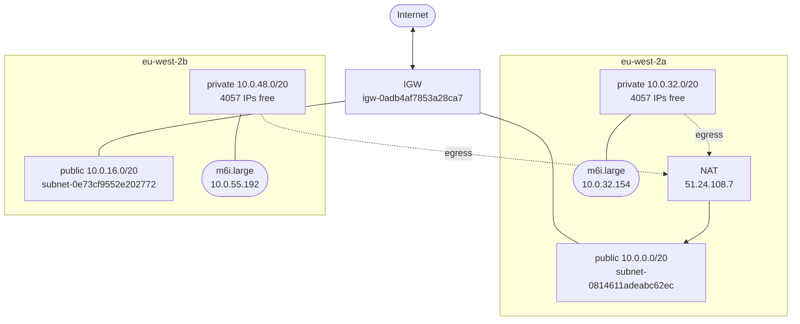
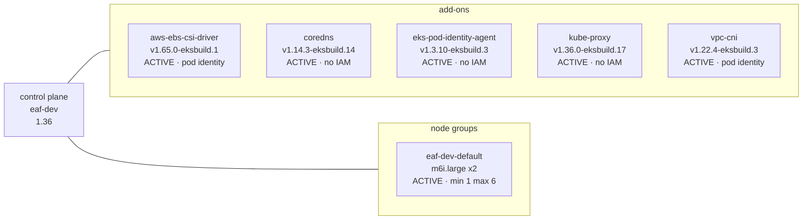

# Live AWS topology — `718438899462` / `eu-west-2`

*Generated by `make topology`. Read from the AWS API, so this is what exists,
not what the configuration intends. Regenerate rather than edit.*

## Network

## EKS cluster `eaf-dev`

| | |
|---|---|
| status | `ACTIVE` |
| version | `1.36` (platform `eks.10`) |
| authentication | `API` |
| endpoint | public=True private=True |
| public CIDRs | `0.0.0.0/0` |
| support | `STANDARD` |

### Who can reach the Kubernetes API

| Principal | Policies | Scope |
|---|---|---|
| `OrganizationAccountAccessRole` | `AmazonEKSClusterAdminPolicy` | cluster |
| `AWSServiceRoleForAmazonEKS` | `AmazonEKSClusterInsightsPolicy` | cluster |
| `AWSServiceRoleForAmazonEKS` | `AmazonEKSEventPolicy` | cluster |
| `AWSServiceRoleForAmazonEKS` | `AmazonEKSPodIdentityPolicy` | cluster |
| `eaf-dev-platform-eks-node-role` | *none* | — |

*Entries with no policies are registered but hold no permissions. EKS creates
some automatically — the node role and the cluster's own service-linked role.*

### Pod Identity — which service account gets which role

| Namespace | Service account | Role | Managed by |
|---|---|---|---|
| `kube-system` | `aws-node` | `eaf-dev-platform-vpc-cni-role` | add-on `vpc-cni` |
| `kube-system` | `ebs-csi-controller-sa` | `eaf-dev-platform-ebs-csi-role` | add-on `aws-ebs-csi-driver` |

*An association owned by an add-on is one the add-on maintains for itself, which
is what `pod_identity_association` on `aws_eks_addon` produces. Anything showing
as unmanaged was created outside this layer.*

## Pod IP allocation

**Prefix delegation is active.** 2 network interfaces carry 4 `/28` prefixes between them, rather than individual secondary addresses.

| ENI | Prefixes | Pod IPs from prefixes |
|---|---|---|
| `eni-013687da4c92034c2` | `10.0.42.112/28`, `10.0.40.176/28` | 32 |
| `eni-070891dd20a07e815` | `10.0.58.64/28`, `10.0.56.32/28` | 32 |

*Each `/28` is 16 addresses. Without prefix delegation the CNI assigns secondary
IPs one at a time and the per-node pod ceiling is far lower — which is a limit on
pod count reached long before CPU or memory runs out.*

